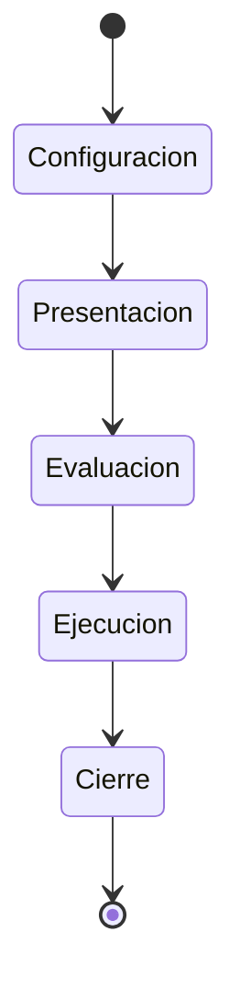
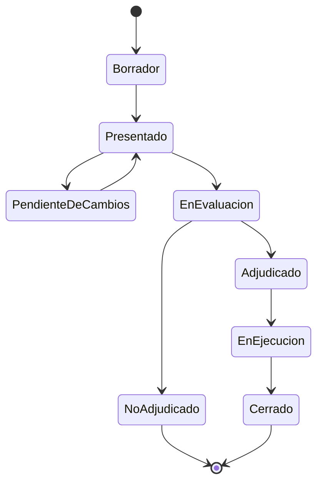

# Documentación Funcional — UBANEX

> Audiencia: equipo de producto, cliente (Secretaría de Extensión / Rectorado UBA) y equipo de desarrollo.
> Fuente de verdad de requerimientos: [`project_context.md`](./project_context.md). Fuente de verdad de reglas de dominio: [`dominio/modelo.md`](./dominio/modelo.md). Este documento es una **síntesis funcional operativa** que integra ambas y agrega el estado real de implementación.

## Índice

1. [Objetivo y alcance](#1-objetivo-y-alcance)
2. [Glosario de dominio](#2-glosario-de-dominio)
3. [Actores y roles](#3-actores-y-roles)
4. [Ciclo de vida de una convocatoria](#4-ciclo-de-vida-de-una-convocatoria)
5. [Módulo 1 — Convocatorias y Presentación](#5-módulo-1--convocatorias-y-presentación)
6. [Módulo 2 — Evaluación y Adjudicación](#6-módulo-2--evaluación-y-adjudicación)
7. [Módulo 3 — Ejecución, Rendición y Seguimiento](#7-módulo-3--ejecución-rendición-y-seguimiento)
8. [Módulo 4 — Cierre](#8-módulo-4--cierre)
9. [Sugerencias de cambio y notificaciones](#9-sugerencias-de-cambio-y-notificaciones)
10. [Auditoría](#10-auditoría)
11. [Matriz de permisos por rol](#11-matriz-de-permisos-por-rol)
12. [Estado de implementación](#12-estado-de-implementación)
13. [Preguntas abiertas / decisiones pendientes](#13-preguntas-abiertas--decisiones-pendientes)

---

## 1. Objetivo y alcance

UBANEX digitaliza de punta a punta la gestión de las convocatorias de extensión universitaria de la UBA: presentación de proyectos, evaluación, adjudicación con orden de mérito, ejecución con seguimiento, rendición de fondos y cierre. Reemplaza un proceso hoy basado en formularios sueltos, PDFs, correo electrónico y Google Drive, que genera duplicación de información, falta de trazabilidad y ausencia de estadísticas.

**Es:**
- Un sistema de gestión configurable para convocatorias de extensión (formularios dinámicos, evaluaciones configurables, roles y permisos).
- Un registro centralizado del ciclo de vida completo del proyecto, con historial y auditoría.

**No es:**
- Una red social, portal público o blog institucional.
- Un sistema académico integral tipo SIU.
- Un reemplazo de GDE (gestión documental electrónica del Estado).
- Un sistema que realiza pagos o evalúa proyectos automáticamente.
- Un sistema que garantiza adjudicaciones (el resultado depende de presupuesto y reglas, no del sistema en sí).

## 2. Glosario de dominio

| Término | Definición |
|---|---|
| **Convocatoria** | Instancia anual del proceso UBANEX. Tiene 5 etapas y define templates, fechas, presupuesto y reglas de esa edición del proceso. |
| **Proyecto** | Entidad raíz con datos estables entre años (nombre, si es consolidado, si es interfacultad). |
| **Edición** | Instancia de un Proyecto dentro de una Convocatoria específica (un proyecto puede tener varias ediciones a lo largo de los años). |
| **Unidad Académica (UA)** | Cada una de las 14 facultades de la UBA. Tiene su propia Secretaría de Extensión. |
| **Rectorado** | Órgano central, no pertenece a ninguna UA. Administra el sistema y emite adjudicaciones. |
| **Emparejamiento** | Par de UAs definido por convocatoria para la evaluación cruzada (7 pares para 14 UAs). |
| **Evaluación Institucional** | Evaluación que hace la Secretaría de la UA del proyecto. |
| **Evaluación Cruzada** | Evaluación que hacen docentes evaluadores de la UA propia y de la UA emparejada (y, ante inconsistencia, una tercera UA). |
| **Orden de Mérito** | Ranking de ediciones evaluadas por nota final, usado para proponer la adjudicación. |
| **Cuota Federativa** | Mínimo de proyectos a adjudicar por UA, actúa como piso independiente del mérito. |
| **Consolidación** | Estado derivado de adjudicarse en convocatorias consecutivas; habilita saltear evaluación. |
| **Hito** | Actividad registrada por el director durante la etapa de Ejecución. |
| **Rendición** | Proceso de justificar el uso del presupuesto adjudicado mediante comprobantes (**no implementado aún**, ver §12). |
| **Informe Final** | Documento de cierre autogenerado desde los hitos, editable y confirmable por el director. |
| **Autoevaluación de Impacto** | Cuestionario de cierre configurable, completado por el director. |
| **Sugerencia de Cambio** | Pedido de corrección de la Secretaría/Rectorado sobre una edición ya presentada. |

## 3. Actores y roles

Los roles se dividen en **dos grupos excluyentes**: un usuario no puede tener roles de ambos grupos a la vez.

| Grupo | Roles | Alcance |
|---|---|---|
| **Gestión** | `AutoridadDeRectorado`, `AsistenteDeRectorado` | Global (no pertenecen a una UA) |
| **Gestión** | `AutoridadDeSecretaria`, `AsistenteDeSecretaria` | Por Unidad Académica |
| **Ejecución** | `Estudiante`, `Docente` | Global; habilitan roles de ejecución por convocatoria |

Además, sobre usuarios `Docente` validados, se asignan **roles de ejecución por convocatoria** vía `ParticipacionConvocatoria`:

| Rol de ejecución | Quién lo asigna | Notas |
|---|---|---|
| `DirectorDeProyecto` | El creador de la edición (mientras esté en `Borrador`), o cualquier rol de Gestión (Rectorado o Secretaría) | Máx. 2 participaciones como director por convocatoria; un director principal obligatorio + uno opcional |
| `Evaluador` | **Autoridad de Rectorado** (alta directa según resolución oficial) | Cupo de 3 evaluadores por UA por convocatoria; incompatible con presentar proyectos en la misma convocatoria |

**Resumen de funciones por rol** (detalle completo en [`project_context.md` §5](./project_context.md)):

- **Autoridad de Rectorado** (1 a 3): crea/configura convocatorias, define emparejamientos, valida proyectos, emite adjudicaciones, administra usuarios, da de alta/baja evaluadores, modifica convocatorias incluso cerradas.
- **Asistente de Rectorado** (0 a N): igual que Autoridad salvo confirmaciones finales (adjudicación, cierre de convocatorias).
- **Autoridad de Secretaría** (1 a 3 por UA): valida proyectos y docentes de su UA, completa y **confirma** evaluaciones institucionales, crea Asistentes de Secretaría.
- **Asistente de Secretaría** (0 a N por UA): completa evaluaciones institucionales sin poder confirmarlas; no valida docentes ni crea usuarios.
- **Docente** (0 a N): se registra y requiere validación de la Secretaría de su UA; puede ser Director o Evaluador por convocatoria.
- **Estudiante** (0 a N): se registra sin validación; solo visualiza proyectos en los que participa.

> **Verificado en código**: el endpoint de validación de docentes (`PATCH /usuarios/:id/estado-validacion-docente`) también autoriza a **Autoridad de Rectorado**, además de Autoridad/Asistente de Secretaría — sin restricción adicional de UA en el service. Es decir, Rectorado puede validar docentes de cualquier UA, no solo la Secretaría de la UA del docente.

## 4. Ciclo de vida de una convocatoria

- Cada convocatoria tiene **año** y transita 5 estados/etapas fijas.
- `Presentación`, `Evaluación` y `Ejecución` tienen fecha de inicio y fin configurables. `Configuración` y `Cierre` no.
- Cada etapa habilita/deshabilita acciones específicas para directores, evaluadores y Secretaría (detalladas en cada módulo abajo).

## 5. Módulo 1 — Convocatorias y Presentación

### 5.1 Configuración de la convocatoria

Durante `Configuración`, Rectorado define:
- **Solo Autoridad de Rectorado**: nombre, año, fechas de cada etapa, presupuesto total, cuota federativa, topes de presupuesto por proyecto (consolidado / no consolidado), parámetros de extra por insumos y por PSE (datos base de la Convocatoria).
- **Autoridad o Asistente de Rectorado**: el **Formulario** de presentación, los templates de evaluación institucional/cruzada/autoevaluación de impacto, y el **Emparejamiento** de las 14 UAs en 7 pares (estos son sub-recursos de configuración, con permiso más amplio que los datos base).

### 5.2 Formularios dinámicos

- Cada convocatoria tiene **un** formulario propio, congelado automáticamente al pasar a `Presentación`.
- Tipos de campo soportados: `texto`, `texto_largo`, `numero`, `fecha`, `geolocalizacion`, `booleano`, `checkbox`, `select`, `usuario`, `tabla`, `seccion`, `archivo`.
  - `archivo` está deshabilitado (sin almacenamiento de adjuntos aún).
  - `seccion` es solo un separador visual, sin dato asociado.
  - `tabla` admite columnas tipadas propias con mínimos/máximos de filas.
- Cada campo se marca obligatorio u opcional; las respuestas se validan contra esa configuración al enviar la edición.
- Las plantillas (`esPlantilla: true`) son reutilizables entre convocatorias; puede marcarse una como `esDefault` para sugerirla primero.

### 5.3 Proyecto y Edición

- El **Proyecto** persiste entre años; la **Edición** es su instancia dentro de una convocatoria puntual.
- Cada edición pertenece a la UA del director principal.
- Estados de una edición:

- `NoAdjudicado` es terminal: no hay suplencias.
- Cada edición requiere un director principal (`esDirectorPrincipal = true`) y admite un codirector opcional.
- Un usuario puede dirigir como máximo **2 proyectos por convocatoria**.
- El presupuesto solicitado se compone de 3 rubros fijos (Viáticos y Seguros, Bienes de Consumo, Bienes de Uso); el sistema recalcula siempre los subtotales y el total a partir de las partidas cargadas, ignorando lo que envíe el frontend.
- Existe un flujo de **reenvío ("resubir")**: una edición `PendienteDeCambios` puede corregirse y volver a `Presentado`.

## 6. Módulo 2 — Evaluación y Adjudicación

### 6.1 Evaluación Institucional

- Una por edición, a cargo de la Secretaría de la UA del proyecto.
- La completan Autoridades o Asistentes; **solo una Autoridad confirma**.
- Estados: `Borrador → Confirmada`.
- Estructura configurable: categorías con subcategorías numéricas (suman puntaje) o booleanas (informativas, no suman), más un checklist independiente que tampoco suma.
- Campo fijo obligatorio `esPse` (Práctica Social Educativa): no suma puntaje, pero habilita un extra en el presupuesto a adjudicar.

### 6.2 Evaluación Cruzada

- Entre 0 y 3 evaluaciones por edición: **Propia** (UA del proyecto), **Ajena** (UA emparejada) y, si hay inconsistencia, **TerceraUa**.
- La confirma el propio evaluador (sin instancia superior).
- Estructura configurable en 5 categorías con ítems de puntaje máximo/asignado; el cuadro de puntuación final es calculado, no almacenado.
- **Conflicto de interés**: un evaluador no puede evaluar su propio proyecto ni uno donde participe.
- **Inconsistencia**: si la diferencia entre Propia y Ajena confirmadas alcanza el `umbralInconsistenciaCruzada` (default 40), se habilita designar una tercera UA. Mientras no se resuelva, se bloquea generar y confirmar el orden de mérito de la convocatoria. Al confirmarse, la TerceraUa **reemplaza** a Propia y Ajena en el cálculo (no se promedian las tres).

### 6.3 Proyectos consolidados

- Un proyecto se consolida al adjudicarse en **3 convocatorias consecutivas**; desde la 5ta participación consecutiva **saltea evaluación en años alternos**. Un hueco (no participó o `NoAdjudicado`) reinicia la racha vigente.
- Rectorado puede forzar el estado (`esConsolidado` tri-estado: `null` automático, `true`/`false` forzado). **Verificado en código**: el override no es exclusivo de Rectorado — cualquier rol de Gestión (Autoridad/Asistente de Rectorado **o** de Secretaría) puede editarlo mientras la edición esté en `Borrador`, `Presentado` o `PendienteDeCambios`. Esto difiere de lo que indica `dominio/modelo.md` ("solo Rectorado edita el override"); este documento sigue el comportamiento real del código.
- **`fueConsolidadoAlgunaVez`** (regla adicional no reflejada en `dominio/modelo.md`): a diferencia de la racha vigente, este flag es **irreversible** — una vez que el proyecto alcanzó racha ≥ 3 en algún momento, queda marcado para siempre aunque después haya huecos que reinicien la racha. Se usa exclusivamente para determinar el **tope de presupuesto solicitado** (consolidado vs. no consolidado), no para el salteo de evaluación.
- Los proyectos consolidados que saltean evaluación pasan directo a `Adjudicado` y encabezan el orden de mérito.

### 6.4 Orden de mérito y adjudicación

- El orden de mérito se genera **on demand** (lo dispara Rectorado), no automáticamente.
- **Nota final**: `notaFinal = round((promedioCruzadas + puntajeInstitucional) * 10) / 10`. El puntaje institucional es la suma de subcategorías numéricas; `esPse` no suma.
- **Adjudicación propuesta**: se arma un borrador ajustable limitado por `presupuestoTotal`, descontando el **presupuesto a adjudicar** de cada edición (solicitado + extra por insumos + extra por PSE), no el solicitado.
- **Cuota federativa** como piso por UA, algoritmo de 3 pasos: mérito global con tope por UA → piso de cuota → swap por excedente.
- Rectorado puede ajustar la propuesta mientras no esté confirmada. `confirmarOrdenMerito` fija el resultado y notifica a cada director si su proyecto quedó adjudicado o no.
- **Emisión formal**: confirmar el orden de mérito no es lo mismo que emitir la adjudicación. La **emisión de la resolución formal de adjudicación** es una acción separada y posterior, exclusiva de **Autoridad de Rectorado** (el Asistente puede generar el orden de mérito y ajustar la propuesta borrador, pero no confirmarla ni emitirla).
- No hay umbral mínimo de nota: el corte lo determinan presupuesto y cuota federativa.

## 7. Módulo 3 — Ejecución, Rendición y Seguimiento

Comienza cuando se firma la resolución de adjudicación (edición pasa a `EnEjecucion`).

### 7.1 Presupuesto

- Cada edición tiene presupuesto desde su creación (puede estar vacío en `Borrador`).
- 3 rubros fijos: Viáticos y Seguros (por tipo de persona: Docente/Estudiante), Bienes de Consumo, Bienes de Uso.
- Los bienes marcados `esInsumo` que superan el umbral configurado disparan un extra en el presupuesto a adjudicar.

### 7.2 Rendición — **no implementada aún**

Diseño objetivo (no operativo hoy):
- Una Rendición por Edición, activa durante `Ejecución`.
- El director sube Comprobantes (PDF/imagen) por rubro.
- Estado individual del comprobante: `EnRevisión → Aceptado | Rechazado`, con comentario de rechazo y posibilidad de reemplazo.

**Estado real del código** (verificado contra `rendicion.entity.ts`): la tabla `Rendicion` ya tiene columnas por fila (`proyectoId`, `rubro`, `monto`, `fecha`, `comprobanteUrl` opcional, `estado` con default `'pendiente'`), pero:
- Se relaciona con **Proyecto** (`proyectoId`), no con Edición como plantea el diseño objetivo.
- No existe una entidad `Comprobante` separada ni reemplazo/historial de comprobantes.
- El único endpoint expuesto es `GET /rendiciones` (listado, filtrable por `proyectoId`); no hay altas, ni cambio de estado, ni revisión.
- El seed no crea filas de `Rendicion`: en una base recién sembrada la tabla queda vacía.

### 7.3 Seguimiento de ejecución (Hitos)

- Los directores registran `Hito`s: título, descripción, fecha inicio/fin, integrantes (texto libre) y categoría fija (`Organizacion`, `Capacitacion`, `ActividadConLaComunidad`, `Articulacion`, `Difusion`, `InformeParcial`).
- Editables/eliminables mientras la edición esté en `Ejecución`.
- Visibles solo para Secretaría de la UA correspondiente y Rectorado.

## 8. Módulo 4 — Cierre

- Al pasar la convocatoria a `Ejecución`, se crea un **Informe Final** vacío por edición, con contenido autogenerado a partir de los hitos.
- El director lo edita libremente y opcionalmente adjunta un PDF. Estado `Borrador → Confirmado` (definitivo, sin aprobación posterior).
- La **Autoevaluación de Impacto** (template configurable con preguntas de texto, booleano, escala numérica, select o checkbox) la completa el director durante `Ejecución`. Estado `Borrador → Completada`.

**Requisitos para pasar la edición a `Cerrado`** (diseño objetivo):
- [ ] Informe Final `Confirmado`.
- [ ] Autoevaluación de Impacto `Completada`.
- [ ] Rendición con todos los comprobantes `Aceptado`.

> **Estado real:** existen las confirmaciones individuales de informe y autoevaluación, pero la transición automática de la edición a `Cerrado` validando los 3 requisitos **todavía no está construida**. Hoy `Cerrado` solo lo produce el seed.

## 9. Sugerencias de cambio y notificaciones

- Una **Sugerencia de Cambio** es un pedido de corrección de la Secretaría de la misma UA (o Rectorado) sobre una edición en estado `Presentado`.
- El campo sugerido puede pertenecer al Proyecto, a la Edición, al presupuesto o a una respuesta del formulario dinámico.
- Responde el creador de la edición o sus directores (o Rectorado). La respuesta es única y terminal: `Aceptada` (aplica el cambio automáticamente), `Rechazada` o `MasInformacion` (no reabre; requiere una sugerencia nueva).
- **Notificaciones** in-app (y mail para alta de evaluador) por: nueva sugerencia, respuesta a sugerencia, resultado de alta como evaluador, resultado de adjudicación. El destinatario puede marcarlas leídas o eliminarlas.

## 10. Auditoría

- El sistema registra acciones relevantes (alta/baja/modificación de usuarios y entidades clave) con actor, tipo de acción, tipo de entidad y fecha, para trazabilidad institucional.

## 11. Matriz de permisos por rol

| Acción | Aut. Rectorado | Asist. Rectorado | Aut. Secretaría | Asist. Secretaría | Director | Evaluador | Estudiante |
|---|:---:|:---:|:---:|:---:|:---:|:---:|:---:|
| Crear / editar / eliminar convocatoria (datos base: fechas, presupuesto, cuota federativa) | ✅ | ❌ | ❌ | ❌ | ❌ | ❌ | ❌ |
| Configurar formulario, templates de evaluación, emparejamiento (sub-recursos) | ✅ | ✅ | ❌ | ❌ | ❌ | ❌ | ❌ |
| Dar de alta/baja Evaluadores | ✅ | ❌ | ❌ (solo consulta) | ❌ | ❌ | ❌ | ❌ |
| Validar Docentes de su UA | ✅ | ❌ | ✅ | ❌ | ❌ | ❌ | ❌ |
| Crear proyecto / edición | ❌ | ❌ | ❌ | ❌ | ✅ | ❌ | ❌ |
| Completar evaluación institucional | ❌ | ❌ | ✅ | ✅ | ❌ | ❌ | ❌ |
| Confirmar evaluación institucional | ❌ | ❌ | ✅ | ❌ | ❌ | ❌ | ❌ |
| Cargar/confirmar evaluación cruzada | ❌ | ❌ | ❌ | ❌ | ❌ | ✅ | ❌ |
| Generar orden de mérito / ajustar propuesta de adjudicación | ✅ | ✅ | ❌ | ❌ | ❌ | ❌ | ❌ |
| Confirmar orden de mérito | ✅ | ❌ | ❌ | ❌ | ❌ | ❌ | ❌ |
| Emitir adjudicación (resolución formal) | ✅ | ❌ | ❌ | ❌ | ❌ | ❌ | ❌ |
| Designar tercera UA (inconsistencia cruzada) | ✅ | ✅ | ❌ | ❌ | ❌ | ❌ | ❌ |
| Forzar `esConsolidado` de un proyecto | ✅ | ✅ | ✅ | ✅ | ❌ | ❌ | ❌ |
| Crear sugerencia de cambio | ✅ | ✅ | ✅ (su UA) | ✅ (su UA) | ❌ | ❌ | ❌ |
| Responder sugerencia | ❌ | ❌ | ❌ | ❌ | ✅ | ❌ | ❌ |
| Registrar hitos | ❌ | ❌ | ❌ | ❌ | ✅ | ❌ | ❌ |
| Ver hitos | ✅ | ✅ | ✅ (su UA) | ✅ (su UA) | ✅ (propios) | ❌ | ❌ |
| Completar informe final / autoevaluación | ❌ | ❌ | ❌ | ❌ | ✅ | ❌ | ❌ |
| Ver proyectos en los que participa | — | — | — | — | — | — | ✅ |

> Nota: "Asistente de Rectorado" no puede realizar confirmaciones finales (adjudicación, cierre de convocatoria) según regla general del rol, aunque comparte la mayoría de acciones de configuración con la Autoridad.

## 12. Estado de implementación

| Capacidad | Estado |
|---|---|
| Autenticación JWT, registro Estudiante/Docente, roles y guards | ✅ Implementado |
| CRUD de usuarios, validación de docentes, catálogos (UA, carreras, geo) | ✅ Implementado |
| CRUD de convocatorias, estados y fechas por etapa | ✅ Implementado |
| Formularios dinámicos (12 tipos de campo, tablas, plantillas) | ✅ Implementado |
| Proyectos y ediciones, presupuesto de 3 rubros, aval, resubida | ✅ Implementado |
| Emparejamiento de UAs | ✅ Implementado |
| Evaluación institucional y cruzada + plantillas configurables | ✅ Implementado |
| Consolidación (derivada + override) y salteo de evaluación | ✅ Implementado |
| Orden de mérito y adjudicación propuesta (mérito + cuota federativa) | ✅ Implementado |
| Desempate por tercera evaluación (inconsistencia cruzada) | ✅ Implementado |
| Hitos de ejecución | ✅ Implementado |
| Autoevaluación de impacto + Informe Final (con confirmaciones individuales) | ✅ Implementado |
| Sugerencias de cambio + notificaciones in-app/mail | ✅ Implementado |
| Auditoría de acciones | ✅ Implementado |
| **Rendición de comprobantes** (entidad `Comprobante`, flujo de revisión) | ❌ No implementado — tabla mínima de solo lectura |
| **Transición automática de Edición a `Cerrado`** validando los 3 requisitos | ❌ No implementado |
| **Almacenamiento de adjuntos** (campo `archivo`, comprobantes, aval como archivo real) | ❌ No implementado — `archivo` deshabilitado, aval es URL |

## 13. Preguntas abiertas / decisiones pendientes

Ver detalle completo en [`project_context.md` §15](./project_context.md#15-preguntas-pendientes). Resumen de lo aún no resuelto:

- **Infraestructura de adjuntos**: dónde se almacenarán documentos (comprobantes, formularios tipo archivo), límites de espacio, disponibilidad de infraestructura FIUBA vs. nube.
- **Integración con GDE**: si se integrará, y si solo se guardan códigos de expediente o también los documentos.
- **Rendición**: flujo exacto de aprobación, estados finales y responsables (Secretaría, Rectorado o ambos), límite de reemplazos de comprobantes rechazados.
- **Autoevaluación de impacto**: si el template se comparte entre convocatorias como los formularios, y si hay mínimo de preguntas obligatorias.

> Contradicción histórica resuelta: el documento de requerimientos original (§5 en `project_context.md`) menciona a la Secretaría asignando evaluadores; el modelo de dominio implementado y vigente (`dominio/modelo.md`) establece que el alta/baja de evaluadores es exclusiva de **Autoridad de Rectorado**, leyendo la resolución oficial. Este documento sigue la regla vigente en código.

> ⚠️ **Discrepancia código vs. regla de negocio a validar con el equipo**: el endpoint `POST /proyectos` autoriza tanto a `Docente` como a `Estudiante` (`@Roles(RolUsuario.Estudiante, RolUsuario.Docente)` en `proyectos.controller.ts`), y `ProyectosService.crearProyecto` no rechaza explícitamente al rol `Estudiante`. Esto contradice la regla documentada en §3 y en `project_context.md` ("Estudiante... no puede ser asignado a roles de ejecución", solo visualiza proyectos). No se corrigió unilateralmente en este documento porque podría tratarse de un defecto de autorización en el backend, no de una decisión de producto — requiere confirmación explícita antes de decidir si se ajusta el código o se documenta como excepción intencional.
