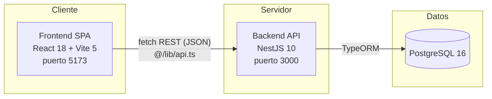

# Documentación Técnica — UBANEX

> Audiencia: equipo de desarrollo (backend/frontend).
> Complementa [`Documentacion Funcional.md`](./Documentacion%20Funcional.md) (qué hace el sistema) y [`dominio/modelo.md`](./dominio/modelo.md) (reglas de negocio). Este documento describe **cómo** está construido: arquitectura, módulos, entidades, contratos de API, frontend y convenciones. Convenciones de código detalladas viven en [`AGENTS.md`](../AGENTS.md); acá se referencian, no se duplican.

## Índice

1. [Arquitectura general](#1-arquitectura-general)
2. [Backend — NestJS](#2-backend--nestjs)
3. [Frontend — React](#3-frontend--react)
4. [Autenticación y autorización](#4-autenticación-y-autorización)
5. [Persistencia y migraciones](#5-persistencia-y-migraciones)
6. [Seed de datos](#6-seed-de-datos)
7. [Testing](#7-testing)
8. [Convenciones de código](#8-convenciones-de-código)
9. [Trazabilidad funcional → técnica](#9-trazabilidad-funcional--técnica)
10. [Deuda técnica conocida](#10-deuda-técnica-conocida)

---

## 1. Arquitectura general



Monorepo con dos aplicaciones independientes (`backend/`, `frontend/`) orquestadas por Docker Compose en desarrollo y desplegadas como dos servicios separados en Render (ver [`Documentacion de Infraestructura.md`](./Documentacion%20de%20Infraestructura.md)). No hay backend-for-frontend ni gateway intermedio: el frontend consume la API REST del backend directamente.

## 2. Backend — NestJS

### 2.1 Patrón de módulo

Cada carpeta bajo `backend/src/` es un módulo de NestJS con el patrón:

```
<modulo>/
├── <modulo>.module.ts       # Declaración del módulo (imports, providers, controllers)
├── <modulo>.controller.ts   # Endpoints REST
├── <modulo>.service.ts      # Lógica de negocio y acceso a datos (repositorios TypeORM)
├── <modulo>.entity.ts       # Entidad(es) TypeORM
└── dto/                     # DTOs de entrada validados con class-validator
```

> Nota sobre capas: [`AGENTS.md`](../AGENTS.md) describe una orientación a DDD (domain/application/infrastructure). En la implementación actual **no existe esa separación física de carpetas**: cada módulo concentra entidad, DTOs, controller y service juntos, siguiendo el patrón estándar de NestJS. Es la convención real a seguir hoy; cualquier migración a capas DDD explícitas sería un cambio de arquitectura a decidir aparte.

> Nota sobre modelo conceptual vs. esquema físico: [`dominio/modelo.md`](./dominio/modelo.md) modela algunos atributos como *value objects* (ej. `RangoFechas` con `inicio`/`fin`). En la base de datos real esto está **aplanado** en columnas independientes (ej. `Convocatoria.fechaInicioPresentacion` / `fechaFinPresentacion` como `date` nullable, ídem para Evaluación y Ejecución). No buscar una clase `RangoFechas` en el código: es una abstracción del diagrama de dominio, no una entidad ni columna real.

### 2.2 Módulos existentes (`app.module.ts`)

| Módulo | Responsabilidad |
|---|---|
| `auth/` | Login, registro, JWT, guards de rol y de participación |
| `usuarios/` | CRUD de usuarios, perfiles docente/estudiante, validación de docentes |
| `convocatorias/` | CRUD de convocatorias, estados, fechas por etapa, emparejamiento de UAs |
| `formularios/` | Formularios dinámicos y plantillas de presentación |
| `proyectos/` | Proyectos, ediciones, presupuesto, consolidación, aval, resubida |
| `evaluaciones/` | Evaluación institucional y cruzada, orden de mérito, adjudicación, inconsistencia/tercera UA |
| `templates-evaluacion/` | Plantillas configurables de evaluación institucional y cruzada |
| `participaciones-convocatoria/` | Alta/baja de directores y evaluadores por convocatoria |
| `ejecucion/` | Hitos, informe final, autoevaluación de impacto y sus plantillas |
| `rendiciones/` | Rendición: carga de comprobantes por rubro y revisión (aceptar/rechazar) por Rectorado |
| `sugerencias/` | Sugerencias de cambio y notificaciones |
| `auditoria/` | Registro de acciones de auditoría |
| `unidades-academicas/`, `carreras/`, `geo/` | Catálogos de referencia |
| `seed/` | Seed idempotente de datos de desarrollo |

> `common/` no es un módulo de NestJS (no se importa en `app.module.ts`): es código compartido — enums, DTOs base, constantes, interfaces y el helper de mail — que consumen los demás módulos.

### 2.3 Endpoints REST por módulo

Rutas base (prefijo de recurso, siempre en plural salvo excepciones puntuales):

| Base path | Controller |
|---|---|
| `/auth` | `auth.controller.ts` |
| `/usuarios` | `usuarios.controller.ts`, `auditoria.controller.ts` (sub-rutas de auditoría por usuario) |
| `/convocatorias` | `convocatorias.controller.ts` |
| `/proyectos` | `proyectos.controller.ts` |
| `/evaluaciones` | `evaluaciones.controller.ts` |
| `/formularios` | `formularios.controller.ts` |
| `/participaciones-convocatoria` | `participacion-convocatoria.controller.ts` |
| `/templates-evaluacion-institucional` | `templates-evaluacion-institucional.controller.ts` |
| `/templates-evaluacion-cruzada` | `templates-evaluacion-cruzada.controller.ts` |
| `/templates-autoevaluacion-impacto` | `templates-autoevaluacion.controller.ts` |
| `/hitos` | `hitos.controller.ts` |
| `/informe-final` | `informe-final.controller.ts` |
| `/autoevaluacion-impacto` | `autoevaluacion.controller.ts` |
| `/rendiciones` | `rendiciones.controller.ts` |
| `/unidades-academicas` | `unidades-academicas.controller.ts` |
| `/carreras` | `carreras.controller.ts` |
| `/geo` | `geo.controller.ts` |

Todos los controllers usan DTOs con `class-validator` para el body de entrada y devuelven las entidades (o proyecciones parciales) en JSON. La inyección de dependencias es siempre por constructor (`private readonly servicio: Servicio`).

Cada controller aplica `@UseGuards(JwtAuthGuard, RolesGuard)` a nivel de clase y restringe acciones puntuales con `@Roles(...RolUsuario)` por método; el usuario autenticado se inyecta con el decorator `@CurrentUser()` (ver §4).

#### 2.3.1 Endpoints relevantes no-CRUD (por módulo)

Más allá del CRUD estándar (`GET /`, `GET /:id`, `POST /`, `PATCH /:id`, `DELETE /:id`), estos son los endpoints con lógica de negocio propia:

| Módulo | Endpoint | Propósito |
|---|---|---|
| `convocatorias` | `GET/PUT /convocatorias/:id/emparejamientos` | Consultar/definir el emparejamiento de UAs de la convocatoria |
| `convocatorias` | `GET/PUT /convocatorias/:id/formulario` | Consultar/editar el formulario dinámico de la convocatoria |
| `convocatorias` | `GET/PUT /convocatorias/:id/template-evaluacion-institucional` \| `-cruzada` \| `.../template-autoevaluacion-impacto` | Consultar/editar templates de evaluación y autoevaluación |
| `proyectos` | `POST /proyectos/:id/resubir` | Reenvío de una edición `PendienteDeCambios` |
| `proyectos` | `GET /proyectos/todas` | Listado global de proyectos (gestión/rectorado, sin filtrar por usuario) |
| `proyectos` | `GET /proyectos/disponibles-para-resubir` | Listado de ediciones propias reenviables |
| `proyectos` | `POST /proyectos/:id/ediciones/:edicionId/enviar` | Pasa la edición de `Borrador` a `Presentado` |
| `proyectos` | `DELETE /proyectos/:id/ediciones/:edicionId` | Elimina una edición (solo aplicable en estados tempranos, ej. `Borrador`) |
| `proyectos` | `PATCH /proyectos/:id/ediciones/:edicionId/aval` | Carga la URL del aval firmado |
| `proyectos` | `POST /proyectos/:id/ediciones/:edicionId/iniciar-evaluacion` | Pasa la edición a `EnEvaluacion` |
| `evaluaciones` | `GET /evaluaciones` | Monitoreo agregado de evaluaciones por convocatoria (rectorado) |
| `evaluaciones` | `GET /evaluaciones/convocatoria/:id/orden-merito/ua` \| `/docente` | Orden de mérito agrupado por UA o por docente |
| `evaluaciones` | `POST /evaluaciones/convocatoria/:id/orden-merito` | Genera/recalcula el orden de mérito (on demand) |
| `evaluaciones` | `PATCH /evaluaciones/edicion/:edicionId/adjudicacion-propuesta` | Ajusta manualmente el monto/mecanismo propuesto para una edición antes de confirmar el orden de mérito |
| `evaluaciones` | `GET/PUT /evaluaciones/convocatoria/:id/adjudicacion` | Consultar/ajustar la propuesta de adjudicación |
| `evaluaciones` | `POST /evaluaciones/convocatoria/:id/confirmar-orden-merito` | Fija el resultado y dispara notificaciones |
| `evaluaciones` | `POST /evaluaciones/convocatoria/:id/adjudicacion/emitir` | Emite la resolución formal de adjudicación |
| `evaluaciones` | `GET /evaluaciones/institucionales` \| `/cruzadas/disponibles` | Listados de evaluaciones institucionales/cruzadas pendientes para el evaluador actual |
| `evaluaciones` | `PUT/POST /evaluaciones/institucionales/:edicionId` \| `/confirmar` | Cargar y confirmar evaluación institucional |
| `evaluaciones` | `PUT/POST /evaluaciones/cruzadas/:edicionId` \| `/confirmar` | Cargar y confirmar evaluación cruzada |
| `evaluaciones` | `GET /evaluaciones/institucionales/:edicionId/historial` \| `/cruzadas/:edicionId/historial` | Historial de versiones de una evaluación cargada |
| `evaluaciones` | `GET /evaluaciones/cruzadas/:edicionId/tercera-candidatos` \| `POST .../designar-tercera` | Resolución de inconsistencia cruzada |
| `participaciones-convocatoria` | `GET /participaciones-convocatoria/candidatos` \| `/mias` | Candidatos a evaluador / participaciones propias |
| `ejecucion` (hitos) | `GET/POST /hitos/ediciones/:edicionId` | Listar/crear hitos de una edición |
| `ejecucion` (informe final) | `GET/PUT /informe-final/ediciones/:edicionId`, `POST .../confirmar` | Editar y confirmar el informe final |
| `ejecucion` (autoevaluación) | `GET/PUT /autoevaluacion-impacto/ediciones/:edicionId`, `POST .../completar` | Editar y completar la autoevaluación |
| `sugerencias` | `POST/GET /sugerencias.../ediciones/:edicionId/sugerencias`, `PATCH /sugerencias/:id/responder` | Crear, listar y responder sugerencias |
| `sugerencias` | `GET /notificaciones`, `PATCH .../leer`, `.../leer-todas`, `DELETE .../:id` | Gestión de notificaciones del usuario |
| `usuarios` | `GET /usuarios/buscar`, `PATCH .../estado-validacion-docente`, `POST .../reset-password` | Búsqueda, validación docente, reseteo de contraseña |
| `auditoria` | `GET /usuarios/:id/auditoria` | Historial de auditoría de un usuario |

### 2.4 Enums de dominio (`common/enums/`)

Los estados y catálogos fijos del dominio están tipados como enums TypeScript, entre ellos: `EstadoConvocatoria`, `EstadoEdicion`, `EstadoEvaluacion`, `EstadoComprobante`, `EstadoInforme`, `EstadoAutoevaluacion`, `EstadoSugerencia`, `EstadoPropuestaEvaluador`, `EstadoValidacionDocente`, `RolUsuario`, `RolEjecucion`, `TipoCampo`, `TipoPregunta`, `TipoRubro`, `TipoPersona`, `TipoEvaluacionCruzada`, `TipoNotificacion`, `TipoAccionAuditoria`, `TipoEntidadAuditoria`, `MecanismoAdjudicacion`, `CategoriaHito`, `CargoDocente`, `TipoDesignacionDocente`, `Genero`. Estos enums son la fuente única de verdad para los valores de estado en todo el stack (backend valida, frontend los consume vía `@/data/types.ts`).

## 3. Frontend — React

### 3.1 Estructura

```
frontend/src/
├── main.tsx / App.tsx   # Bootstrap, rutas (react-router-dom 7) y layout (Sidebar + Header)
├── pages/               # Una carpeta/archivo por ruta
├── components/          # Componentes compartidos + primitivos shadcn/ui en components/ui/
├── lib/                 # api.ts (cliente HTTP), utils.ts (cn()), auth-context,
│                        # presupuesto.ts (recalcula subtotales/total de partidas, espejo de
│                        # proyectos/presupuesto.util.ts), secciones-formulario.ts (agrupa
│                        # campos por secciones), tipo-campo-iconos.ts (ícono por TipoCampo)
└── data/                # types.ts — tipos y enums espejo del backend
```

### 3.2 Páginas (`pages/`)

`Login`, `Register`, `Dashboard`, `Convocatorias`, `ConvocatoriaDetail`, `Proyectos`, `ProyectoDetail`, `Evaluacion`, `PlantillasFormulario`, `PlantillaFormularioDetail`, `PlantillasEvaluacion`, `PlantillasAutoevaluacion`, `Usuarios`, `UsuarioDetail`, `ValidacionDocente`.

### 3.3 Rutas y control de acceso (`App.tsx`)

- `/login` y `/register` son públicas; el resto vive bajo `ProtectedRoute` (requiere sesión).
- Restricciones adicionales por rol usando el prop `roles` de `ProtectedRoute`:
  - `ROLES_RECTORADO` (Autoridad/Asistente de Rectorado): `/plantillas-evaluacion`, `/plantillas-autoevaluacion`, `/plantillas-formulario`, `/plantillas-formulario/:id`.
  - `ROLES_GESTION` (los 4 roles de gestión): `/usuarios`, `/usuarios/:id` (este último con `allowOwnId` para que cualquier usuario vea su propio perfil).
- El control de acceso de UI es una capa de UX; la autorización real se aplica en el backend (guards + `RolesGuard`), nunca confiar solo en el frontend para seguridad.

### 3.4 Componentes destacados

- **Builders de configuración**: `FormularioBuilderTab`, `TemplateInstitucionalBuilder`, `TemplateCruzadaBuilder`, `TemplateAutoevaluacionBuilder`, `ColumnasTablaEditor`, `ConfigTipoCampoEditor`.
- **Flujo de edición/proyecto**: `NuevoProyectoDialog`, `ResubirProyectoDialog`, `TablaPartidasPresupuesto`, `CampoFormularioInput` / `CampoFormularioLectura`, `TablaCampoFormulario` (campos tipo tabla), `SeleccionarPlantillaDialog`, `ListaCamposFaltantes`, `CampoSugerible`, `SugerirCambioModal`, `SugerenciasTab`.
- **Evaluación y adjudicación**: `ProyectoEvaluablePanel`, `EvaluacionesProyectoTab`, `EvaluacionConfigTab`, `EmparejamientoTab`, `AdjudicacionResolucionTab`, `AsignacionEvaluadores`, `EvaluadorPerfilDialog`.
- **Ejecución y cierre**: `HitosEjecucionTab`, `InformeFinalTab`, `AutoevaluacionTab`.
- **Usuarios**: `EditarUsuarioDialog`, `UsuarioAutocomplete`, `UsuarioHistorial`, `GestionarDireccionModal`, `DireccionEditor`, `LocalidadAutocomplete`.
- **Layout / shell**: `Sidebar`, `Header`, `NotificacionesDropdown`, `ThemeToggle`, `Logo`, `TableSkeleton`.
- **`components/ui/`**: primitivos shadcn/ui (Radix UI + `class-variance-authority` + Tailwind).

### 3.5 Cliente API

`@/lib/api.ts` centraliza todas las llamadas `fetch` a la API (base URL vía `VITE_API_URL`). Cada nuevo endpoint de backend debe agregarse ahí como función tipada, usando los tipos de `@/data/types.ts` (que reflejan los enums y entidades del backend). No se hacen `fetch` sueltos en componentes de página.

## 4. Autenticación y autorización

- **Login/registro**: `auth/auth.controller.ts` + `auth.service.ts`, con hashing `bcrypt` y tokens JWT (`@nestjs/jwt`, `passport-jwt`).
- **Guards** (`auth/guards/`):
  - `jwt-auth.guard.ts`: valida el token y adjunta el usuario autenticado al request.
  - `roles.guard.ts`: compara `RolUsuario[]` requeridos (vía decorator `@Roles(...)`) contra los roles del usuario autenticado; sin roles declarados, permite el acceso.
  - `participacion.guard.ts`: valida pertenencia/roles de ejecución específicos de una convocatoria (director/evaluador).
- **Decorators** (`auth/decorators/`): exponen `@Roles()` y `@CurrentUser()` (inyecta el usuario autenticado en el handler) como utilidades para leer el usuario del request.
- El frontend guarda el token de sesión y lo adjunta en cada request desde `@/lib/api.ts`; `AuthProvider` (`@/lib/auth-context`) mantiene el estado de sesión en memoria/almacenamiento del navegador.

### 4.1 Configuración global de la aplicación (`main.ts`)

- `ValidationPipe` global con `whitelist: true`, `forbidNonWhitelisted: true` y `transform: true`: cualquier propiedad no declarada en el DTO es rechazada (400), y los payloads se transforman a instancias tipadas antes de llegar al handler.
- CORS habilitado globalmente (`app.enableCors()`) y ETag deshabilitado en la instancia Express subyacente.
- Logging HTTP con `morgan('dev')`.
- El seed tiene **doble guard** de seguridad: además de `UBANEX_SEED=true`, se exige `process.env.RENDER !== 'true'`. Es decir, aunque alguien active `UBANEX_SEED=true` por error en Render, el seed **no corre igual** en ese entorno — evita agotar el heap del proceso al materializar miles de entidades en memoria durante el arranque.

## 5. Persistencia y migraciones

- **ORM**: TypeORM. La configuración de runtime (conexión + toggle de `synchronize`) vive en `TypeOrmModule.forRootAsync` dentro de `backend/src/app.module.ts`; `backend/src/ormconfig.ts` es un `DataSource` aparte que solo usa el CLI de migraciones (`migration:run` / `:revert` / `:show`) y no fija `synchronize`.
- **Desarrollo**: `synchronize: true` (el schema se sincroniza automáticamente contra las entidades en cada arranque local/Docker).
- **Producción (Render)**: `synchronize: false` (detectado vía `process.env.RENDER === 'true'`); los cambios de schema se aplican exclusivamente con migraciones.
- **Migraciones** en `backend/src/migrations/`, gestionadas con scripts npm:
  - `npm run migration:run`
  - `npm run migration:revert`
  - `npm run migration:show`
- Cualquier cambio de entidad que deba llegar a producción **requiere una migración explícita**; `synchronize` no aplica en Render.

## 6. Seed de datos

- `backend/src/seed/` puebla un dataset **chico y curado a mano** (no generado por RNG) pensado para demo: ~46 usuarios (varios por rol y unidad académica, alguno con perfil incompleto o pendiente de validación) y una convocatoria por cada etapa del ciclo (`Configuracion`, `Presentacion`, `Evaluacion`, `Ejecucion`, `Cierre`), con proyectos/ediciones, evaluaciones, hitos, rendiciones, sugerencias y notificaciones coherentes con la etapa de cada una. Es **idempotente** (no duplica si se corre más de una vez).
- Se activa con `UBANEX_SEED=true` **y** requiere `RENDER !== 'true'` (ver §4.1); en Render queda desactivado sin importar el valor de `UBANEX_SEED`.
- El usuario `admin@uba.ar` se preserva siempre; todos los usuarios sembrados (incluido el admin) comparten la misma password (`admin`).
- **Riesgo documentado**: el seed escribe con `repo.save()` directo, sin pasar por DTOs ni `class-validator`, y puede insertar datos que la API rechazaría; las columnas `json` no están tipadas por TypeScript. Ver tabla de mantenimiento en [`AGENTS.md`](../AGENTS.md#seed) — cualquier cambio en `Formulario.campos`, `Edicion.presupuesto`, `templates-default.ts` o entidades debe revisar el seed correspondiente y validarse con `make reset-seed`.

## 7. Testing

- Framework: Jest (`jest.config.js`), con `ts-jest`.
- Specs existentes (backend), una por módulo con lógica de negocio no trivial:
  - `ejecucion/ejecucion.service.spec.ts` — validación de fechas de hitos.
  - `evaluaciones/evaluaciones.service.spec.ts` — reproducibilidad del cálculo de orden de mérito.
  - `proyectos/consolidacion.spec.ts` — orden de convocatorias y cálculo de consolidación/tope.
  - `participaciones-convocatoria/participacion-convocatoria.service.spec.ts` — listado de candidatos, asignación y desasignación de evaluadores.
  - `sugerencias/sugerencias.service.spec.ts` — creación de sugerencias y validación de rutas de presupuesto, respuesta/aceptación.
  - `formularios/campo-formulario.util.spec.ts` — validación de valores y campos incompletos de formularios dinámicos (incluye geolocalización y campos tipo usuario).
  - `common/dto/validador-campos-formulario.spec.ts` — validación de campos de formulario a nivel DTO (tabla y usuario).
  - `proyectos/presupuesto.util.spec.ts` — validación de presupuestos (rubros faltantes/duplicados, montos negativos o NaN, cantidades, fechas y períodos de viáticos).
  - `proyectos/proyectos.service.spec.ts` — eliminación de ediciones y permisos, y normalización/tope de presupuesto al actualizar y enviar una edición.
  - `usuarios/usuarios.service.spec.ts` — reglas de grupos de roles excluyentes, cupos de autoridades por UA y búsqueda de usuarios para formularios.
- Comandos: `npm run test`, `npm run test:watch` (backend). El frontend no tiene suite de tests configurada actualmente.
- Al modificar lógica de cálculo (nota final, presupuesto a adjudicar, consolidación) o de validación de formularios, extender los `.spec.ts` correspondientes en el mismo módulo.

## 8. Convenciones de código

Resumen operativo (detalle completo en [`AGENTS.md`](../AGENTS.md)):

- TypeScript estricto, sin `any`.
- Lenguaje ubicuo del dominio **en español** en backend (clases, métodos, variables, comentarios): `Convocatoria`, `Proyecto`, `Evaluacion`, `Rendicion`, `DirectorDeProyecto`, etc. Código general en inglés donde no sea término de dominio.
- Módulos backend en plural (`usuarios/`, `convocatorias/`); endpoints REST en plural.
- Entidades TypeORM con `@Entity()`, `@PrimaryGeneratedColumn()`, etc.; inyección de dependencias por constructor.
- DTOs de entrada siempre validados con `class-validator`.
- Frontend: una carpeta por página, PascalCase para componentes y archivos, alias `@/` para imports absolutos, primitivos shadcn/ui para consistencia visual, Tailwind utility classes (sin CSS modules/styled-components), `cn()` de `@/lib/utils` para clases condicionales.
- Commits en formato Conventional Commits (`tipo(alcance): mensaje`).
- **No** modificar el cuerpo de requerimientos de `docs/project_context.md` (§1–§15); sí su "Estado actual". **No** instalar librerías sin verificar alternativa existente. **No** generar archivos fuera de `backend/`/`frontend/` salvo necesidad justificada. **No** hacer commit/push sin autorización explícita.

## 9. Trazabilidad funcional → técnica

| Capacidad funcional ([`Documentacion Funcional.md`](./Documentacion%20Funcional.md)) | Módulo backend | Página/componente frontend |
|---|---|---|
| Configuración de convocatoria, fechas por etapa | `convocatorias/` | `Convocatorias`, `ConvocatoriaDetail` |
| Formularios dinámicos y plantillas | `formularios/` | `PlantillasFormulario`, `PlantillaFormularioDetail`, `FormularioBuilderTab`, `CamposFormularioEditor` |
| Proyecto, Edición, presupuesto | `proyectos/` | `Proyectos`, `ProyectoDetail`, `NuevoProyectoDialog`, `TablaPartidasPresupuesto` |
| Emparejamiento de UAs | `convocatorias/` (entidad `Emparejamiento`) | `EmparejamientoTab` |
| Evaluación institucional/cruzada, orden de mérito, adjudicación | `evaluaciones/`, `templates-evaluacion/` | `Evaluacion`, `ProyectoEvaluablePanel`, `EvaluacionesProyectoTab`, `AdjudicacionResolucionTab` |
| Alta/baja de directores y evaluadores | `participaciones-convocatoria/` | `AsignacionEvaluadores`, `EvaluadorPerfilDialog` |
| Hitos, informe final, autoevaluación | `ejecucion/` | `HitosEjecucionTab`, `InformeFinalTab`, `AutoevaluacionTab` |
| Rendición de comprobantes | `rendiciones/` | `ComprobantesTab` |
| Sugerencias y notificaciones | `sugerencias/` | `SugerenciasTab`, `SugerirCambioModal`, `NotificacionesDropdown` |
| Usuarios, validación docente, catálogos | `usuarios/`, `carreras/`, `geo/`, `unidades-academicas/` | `Usuarios`, `UsuarioDetail`, `ValidacionDocente` |
| Auditoría | `auditoria/` | `UsuarioHistorial` |

## 10. Deuda técnica conocida

- **Rendición**: falta el historial/reemplazo de comprobantes rechazados (hoy un comprobante rechazado se re-edita en su misma fila) y la subida de archivos reales (el comprobante es un link). Ver [`dominio/modelo.md`](dominio/modelo.md#rendición) para el estado real de la entidad y el flujo implementado.
- **Cierre automático de Edición**: no existe la transición que valida los 3 requisitos de cierre (informe + autoevaluación + rendición); hoy el estado `Cerrado` solo lo produce el seed.
- **Almacenamiento de adjuntos**: no hay integración de storage de archivos; `TipoCampo.archivo` deshabilitado, avales se cargan como URL de texto.
- **Frontend sin tests automatizados**: solo el backend tiene specs de Jest.
- **Separación DDD aspiracional vs. real**: `AGENTS.md` describe capas domain/application/infrastructure que hoy no existen como carpetas físicas; la convención vigente es el patrón estándar de módulo NestJS (ver §2.1).
