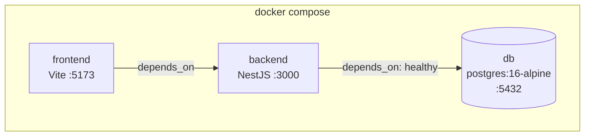
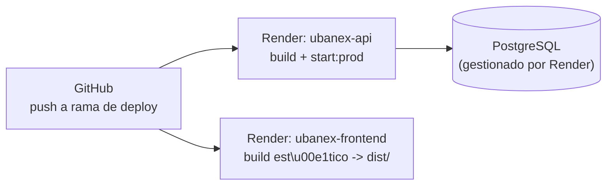

# Documentación de Infraestructura — UBANEX

> Audiencia: equipo de desarrollo y operación/despliegue.
> Describe cómo se levanta el entorno local, cómo se despliega a producción y qué variables/comandos gobiernan cada entorno. Complementa [`Documentacion Tecnica.md`](./Documentacion%20Tecnica.md) (cómo está construido el sistema) y [`Documentacion Funcional.md`](./Documentacion%20Funcional.md) (qué hace).

## Índice

1. [Entornos](#1-entornos)
2. [Entorno local — Docker Compose](#2-entorno-local--docker-compose)
3. [Comandos operativos (Makefile)](#3-comandos-operativos-makefile)
4. [Despliegue en producción — Render](#4-despliegue-en-producción--render)
5. [Variables de entorno](#5-variables-de-entorno)
6. [Base de datos y migraciones](#6-base-de-datos-y-migraciones)
7. [Seed de datos](#7-seed-de-datos)
8. [Logs](#8-logs)
9. [Checklist de despliegue](#9-checklist-de-despliegue)
10. [Riesgos y pendientes de infraestructura](#10-riesgos-y-pendientes-de-infraestructura)

---

## 1. Entornos

| Entorno | Orquestación | Backend | Frontend | Base de datos |
|---|---|---|---|---|
| **Local / desarrollo** | Docker Compose (`docker-compose.yml`) | Contenedor `backend`, hot reload (`nest start --watch`) | Contenedor `frontend`, Vite dev server | Contenedor `db` (PostgreSQL 16) |
| **Producción** | Render (`render.yaml`) | Servicio web Node (`ubanex-api`) | Servicio estático (`ubanex-frontend`) | PostgreSQL gestionado por Render (fuera de `render.yaml`, se asume `DATABASE_URL` provisto por variable de entorno del servicio) |

No hay un entorno de *staging* definido en el repositorio; solo local y producción.

## 2. Entorno local — Docker Compose

Definido en [`docker-compose.yml`](../docker-compose.yml), 3 servicios:

### `db`
- Imagen `postgres:16-alpine`.
- Variables: `POSTGRES_DB=ubanex`, `POSTGRES_USER=postgres`, `POSTGRES_PASSWORD=postgres`.
- Puerto publicado `5432:5432`.
- Volumen persistente `pgdata:/var/lib/postgresql/data`.
- Healthcheck: `pg_isready -U postgres` (5s de intervalo, 5 reintentos) — `backend` espera a que este healthcheck pase (`depends_on: condition: service_healthy`).

### `backend`
- Build desde `./backend` (`backend/Dockerfile`, multi-stage: una etapa `builder` con `python3 make g++` instala dependencias — necesarios para compilar el módulo nativo de `bcrypt` — y la imagen final solo copia `node_modules` ya construido, sin esas herramientas).
- Comando de arranque: `sh -c "npm install && npm run start:dev"` — corre `npm install` en cada arranque para sincronizar `node_modules` con `package.json` tras un `git pull`, ya que el volumen anónimo de `node_modules` persiste entre rebuilds de imagen.
- Puerto publicado `3000:3000`.
- Variables: `DATABASE_URL=postgresql://postgres:postgres@db:5432/ubanex`, `PORT=3000`, `UBANEX_SEED=${UBANEX_SEED:-true}` (seed activo por defecto en local).
- Volúmenes: bind mount `./backend:/app` + volumen anónimo `/app/node_modules` (evita que el bind mount pise las dependencias instaladas en el contenedor).

### `frontend`
- Build desde `./frontend` (ver `frontend/Dockerfile`).
- Comando: `sh -c "npm install && npm run dev -- --host"` (mismo motivo que backend; `--host` expone el dev server fuera del contenedor).
- Puerto publicado `5173:5173`.
- Variable: `VITE_API_URL=http://localhost:3000`.
- Depende de `backend` (sin healthcheck, solo orden de arranque).



## 3. Comandos operativos (Makefile)

Todos se ejecutan desde la raíz del repo:

| Comando | Efecto |
|---|---|
| `make dev` | Levanta `db` + `backend` + `frontend` con logs en foreground (seed activo por default). |
| `make backend` | Levanta solo `db` + `backend` con logs. |
| `make db-only` | Levanta solo PostgreSQL en background. |
| `make shell-backend` | `db` + `backend` en background y abre una shell dentro del contenedor `backend`. |
| `make shell-frontend` | Todos los servicios en background y abre una shell dentro del contenedor `frontend`. |
| `make rebuild` | Reconstruye las imágenes sin caché (usar cuando cambian dependencias del `Dockerfile`). |
| `make reset` | Borra volúmenes (DB + `node_modules`) y reconstruye desde cero. |
| `make seed` | Igual a `dev` forzando `UBANEX_SEED=true` (idempotente, no duplica datos). |
| `make reset-seed` | Borra volúmenes y levanta desde cero con el seed completo. **Comando recomendado tras tocar entidades, `templates-default.ts` o el formulario estándar** (ver [`AGENTS.md`](../AGENTS.md#seed)). |
| `make clean` | `docker compose down -v` + `docker system prune -af --volumes` — libera espacio en disco. |
| `make logs` / `make logs-backend` / `make logs-frontend` | Logs de todos los servicios o de uno específico. |
| `make npm-install` | Corre `npm install` en backend y frontend sin levantar dependencias (útil tras modificar `package.json` sin reiniciar todo). |
| `make help` | Lista todos los targets con su descripción. |

> `reset` y `clean` son **destructivos** (borran volúmenes/datos locales). Usarlos solo cuando se acepta perder el estado actual de la base local.

## 4. Despliegue en producción — Render

Definido en [`render.yaml`](../render.yaml), 2 servicios:

### `ubanex-api` (backend)
- Tipo: `web`, entorno `node`.
- `rootDir: backend`.
- Build: `npm install && npm run build` (compila con `nest build`).
- Start: `npm run start:prod` (`node dist/main`).
- Plan: `free`.
- Variable fija: `UBANEX_SEED=false` — el seed es solo para desarrollo; en producción la base ya tiene datos y no debe re-sembrarse en cada deploy.
- `RENDER=true` (provisto por la plataforma Render) desactiva `synchronize` de TypeORM (ver [`Documentacion Tecnica.md` §5](./Documentacion%20Tecnica.md#5-persistencia-y-migraciones)); los cambios de schema en producción **requieren migraciones explícitas**. `render.yaml` **no** incluye un paso de migración en `buildCommand` ni `startCommand`: aplicarlas es un paso 100% manual (por ejemplo desde la Shell de Render o localmente contra la `DATABASE_URL` de producción) antes o después del deploy, no algo que el pipeline dispare solo.

### `ubanex-frontend`
- Tipo: `static`, entorno `static`.
- `rootDir: frontend`.
- Build: `npm install && npm run build` (`tsc && vite build`).
- Publica el contenido de `dist/` (`staticPublishPath: dist`).
- `pullRequestPreviewsEnabled: false` — no genera previews automáticos por PR.



> El repositorio no define explícitamente el servicio de base de datos de Render (no hay bloque `databases:` en `render.yaml`); se asume aprovisionado manualmente en el dashboard de Render y conectado vía `DATABASE_URL` como variable de entorno del servicio `ubanex-api`. **Verificar y documentar esto en el dashboard de Render como parte de la puesta al día de este documento.**

## 5. Variables de entorno

| Variable | Servicio | Local (Compose) | Producción (Render) | Propósito |
|---|---|---|---|---|
| `DATABASE_URL` | backend | `postgresql://postgres:postgres@db:5432/ubanex` | Provista por Render (no versionada) | Cadena de conexión a PostgreSQL. |
| `PORT` | backend | `3000` | Gestionado por Render | Puerto de escucha de la API. |
| `UBANEX_SEED` | backend | `true` (default; override con `.env` en la raíz o `UBANEX_SEED=false make dev`) | `false` (fijo) | Activa/desactiva el seed idempotente al arrancar. |
| `RENDER` | backend | no seteada | `true` (provista por la plataforma) | Desactiva `synchronize` de TypeORM en producción. |
| `VITE_API_URL` | frontend | `http://localhost:3000` | Debe apuntar a la URL pública de `ubanex-api` en Render | Base URL que usa `@/lib/api.ts` para las requests. |

Variables locales adicionales pueden fijarse en un `.env` en la raíz del repo (gitignoreado), leído por Docker Compose.

## 6. Base de datos y migraciones

- Motor: PostgreSQL 16 (local) / PostgreSQL gestionado (Render).
- ORM: TypeORM, config en `backend/src/ormconfig.ts`.
- **Local**: `synchronize: true` — el esquema se ajusta automáticamente a las entidades en cada arranque (~9s adicionales de boot). Cómodo para desarrollo, pero **no reproduce el comportamiento de producción**.
- **Producción**: `synchronize: false` — cualquier cambio de entidad debe generarse y aplicarse como migración en `backend/src/migrations/`:
  ```bash
  cd backend
  npm run migration:run      # aplica migraciones pendientes
  npm run migration:revert   # revierte la última migración
  npm run migration:show     # lista estado de migraciones
  ```
- Flujo recomendado para un cambio de schema: modificar la entidad → generar/escribir la migración correspondiente → probar localmente con `synchronize` desactivado (o corriendo la migración a mano) → aplicarla **manualmente** en producción (no hay paso automático en `render.yaml`) antes o después del deploy, según la ventana de mantenimiento acordada.

## 7. Seed de datos

- Ubicado en `backend/src/seed/`, corre automáticamente al iniciar el backend si `UBANEX_SEED=true`.
- **Activo por defecto en Docker local**, **desactivado siempre en Render** (`UBANEX_SEED=false` fijo en `render.yaml`).
- Es idempotente: correrlo repetidamente no duplica datos.
- Mantenimiento: cualquier cambio en `Formulario.campos`, `Edicion.presupuesto`, `templates-default.ts` o en entidades con columnas nuevas obligatorias debe revisar y actualizar el seed correspondiente (tabla detallada en [`AGENTS.md`](../AGENTS.md#seed)). Verificar siempre con `make reset-seed`.

## 8. Logs

- Backend usa `morgan` como middleware de logging HTTP (formato estándar de acceso).
- `make logs`, `make logs-backend`, `make logs-frontend` exponen los logs de Docker Compose en local.
- En Render, los logs se consultan desde el dashboard de cada servicio (`ubanex-api` / `ubanex-frontend`); no hay integración con un sistema externo de observabilidad (APM, agregación de logs) documentada en el repositorio.

## 9. Checklist de despliegue

Antes de desplegar un cambio a producción:

- [ ] `npm run lint` y `npm run build` pasan en `backend/` y `frontend/`.
- [ ] Si se modificó alguna entidad: existe una migración nueva en `backend/src/migrations/` y fue probada con `migration:run` / `migration:revert`.
- [ ] Si se tocó el seed o datos de referencia: se corrió `make reset-seed` localmente sin errores.
- [ ] Variables de entorno nuevas (si las hay) están dadas de alta en el dashboard de Render para `ubanex-api` y/o `ubanex-frontend`.
- [ ] `VITE_API_URL` del frontend sigue apuntando a la URL correcta de `ubanex-api`.
- [ ] Cambios de código respetan las convenciones de [`AGENTS.md`](../AGENTS.md) (commits Conventional Commits, sin `any`, DTOs validados).

## 10. Riesgos y pendientes de infraestructura

- **Sin almacenamiento de archivos**: no hay servicio de storage (S3, GCS, disco persistente de Render, etc.) integrado. Bloquea habilitar `TipoCampo.archivo`, comprobantes de rendición reales y carga de avales como archivo (hoy se maneja como URL de texto). Ver preguntas abiertas en [`Documentacion Funcional.md` §13](./Documentacion%20Funcional.md#13-preguntas-abiertas--decisiones-pendientes).
- **Sin entorno de staging**: los cambios van directo de desarrollo local a producción; no hay ambiente intermedio de validación.
- **Sin backups documentados**: no hay política ni automatización de backup/restore de la base de datos de producción descripta en el repositorio; depende de lo que ofrezca el plan de Render contratado.
- **Sin monitoreo/alertas**: no hay integración de observabilidad (uptime, métricas, alertas) más allá de los logs crudos del dashboard de Render.
- **Plan `free` de Render**: sujeto a *cold starts* / límites de recursos del plan gratuito; a validar si es suficiente para el uso real o si debe migrarse a un plan pago antes de producción con usuarios reales.
- **Base de datos de producción no versionada en IaC**: `render.yaml` no declara el servicio de PostgreSQL; su configuración vive solo en el dashboard de Render, fuera de control de versiones.
