# Manual de Usuario — UBANEX

> Audiencia: usuarios finales del sistema (Rectorado, Secretarías de Extensión,
> Directores de Proyecto, Evaluadores, Estudiantes).
> Este manual explica **cómo usar** la aplicación paso a paso. Para el detalle de las
> reglas de negocio ver [`Documentacion Funcional.md`](./Documentacion%20Funcional.md) y
> [`dominio/modelo.md`](./dominio/modelo.md).
>
> Las capturas de pantalla viven en [`assets/manual/`](./assets/manual/).

## Índice

1. [Acceso a la aplicación](#1-acceso-a-la-aplicación)
2. [Registro y validación de cuenta](#2-registro-y-validación-de-cuenta)
3. [La pantalla principal](#3-la-pantalla-principal)
4. [Rectorado — configurar una convocatoria](#4-rectorado--configurar-una-convocatoria)
5. [Rectorado — orden de mérito y adjudicación](#5-rectorado--orden-de-mérito-y-adjudicación)
6. [Secretaría de Extensión](#6-secretaría-de-extensión)
7. [Director de Proyecto — presentar un proyecto](#7-director-de-proyecto--presentar-un-proyecto)
8. [Director de Proyecto — ejecución y cierre](#8-director-de-proyecto--ejecución-y-cierre)
9. [Evaluador](#9-evaluador)
10. [Estudiante](#10-estudiante)
11. [Notificaciones y sugerencias de cambio](#11-notificaciones-y-sugerencias-de-cambio)
12. [Preguntas frecuentes](#12-preguntas-frecuentes)
13. [Índice de capturas](#13-índice-de-capturas)

---

## 1. Acceso a la aplicación

La aplicación se usa desde el navegador (Chrome, Firefox o Edge actualizados).

- **Producción:** https://ubanex.onrender.com
- **Entorno local de desarrollo:** http://localhost:5173

> El servicio de producción está en un plan gratuito de Render: si nadie lo usó en un
> rato, la primera carga puede tardar ~30–60 segundos en "despertar". Es normal; luego
> responde con normalidad.

### Iniciar sesión

1. Entrá a la URL. Si no tenés sesión abierta, te lleva a la pantalla de **Login**.
2. Ingresá tu **email** y **contraseña** y presioná **Iniciar sesión**.
3. Si las credenciales son correctas entrás al **Dashboard**.

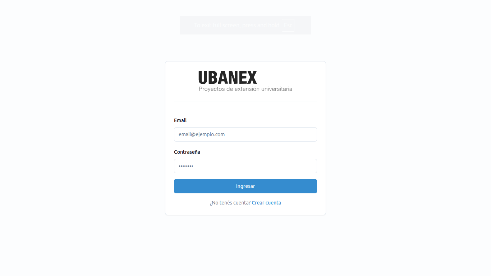

**Credenciales del entorno local (seed de desarrollo):**

| Rol | Email | Contraseña |
|---|---|---|
| Autoridad de Rectorado | `admin@uba.ar` | `admin` |
| Autoridad de Secretaría (Ingeniería) | `autoridad-ingenieria@uba.ar` | `123456` |
| Docente / Director validado (Ingeniería) | `diaz@uba.ar` | `123456` |
| Evaluador validado (Derecho) | `evaluador@uba.ar` | `123456` |
| Estudiante | `rodriguez@uba.ar` | `123456` |

> En producción las cuentas de gestión las crea una Autoridad de Rectorado; los docentes
> y estudiantes se registran por sí mismos (ver §2).

### Cerrar sesión

En la esquina superior derecha, hacé clic en tu identificador de usuario y elegí
**Cerrar sesión**.

---

## 2. Registro y validación de cuenta

Solo los **Estudiantes** y **Docentes** se registran por su cuenta. Las autoridades y
asistentes (Rectorado / Secretaría) las da de alta Rectorado o la Secretaría
correspondiente.

1. En la pantalla de Login, hacé clic en **Crear cuenta** / **Registrarse**.
2. Elegí el tipo de cuenta: **Estudiante** o **Docente**.
3. Completá el formulario:
   - Apellido, Nombre, Email, Teléfono (opcional), Contraseña y su confirmación.
   - **Unidad Académica** (tu facultad).
   - **Carrera** (solo Estudiante, opcional).
4. Presioná **Crear cuenta**.

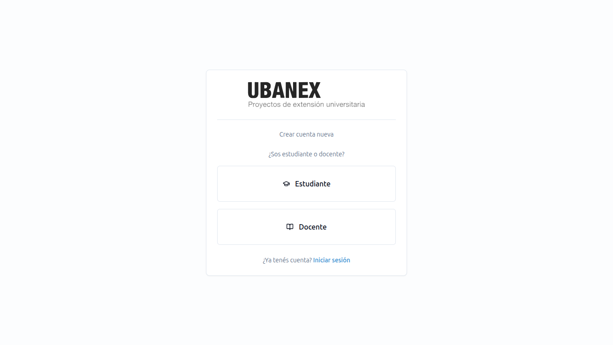

### Diferencias por tipo

| | Estudiante | Docente |
|---|---|---|
| ¿Requiere validación? | No, entra directo | **Sí**: una Autoridad de Secretaría de tu UA debe validarte |
| Mientras tanto | Uso normal | Podés iniciar sesión, pero con acceso limitado hasta ser **Validado** |
| Si te **rechazan** | — | No podés iniciar sesión |

El estado de un docente pasa por `Pendiente de validación → Validado | Rechazado`.
Cuando la Secretaría te valida, ya podés crear proyectos y ser asignado como Director.

---

## 3. La pantalla principal

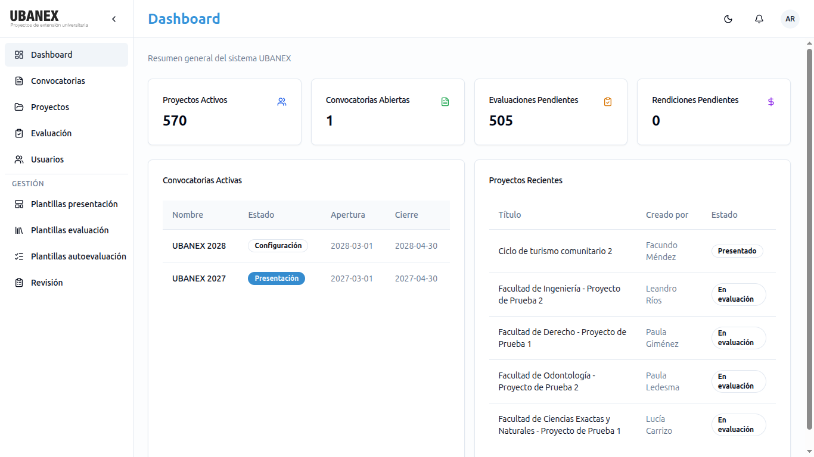

- **Barra lateral (izquierda):** navegación. Los ítems visibles dependen de tu rol:
  - **Dashboard** — resumen.
  - **Convocatorias** — listado de convocatorias.
  - **Proyectos** — tus proyectos (o todos, si sos gestión).
  - **Evaluación** — evaluaciones y orden de mérito.
  - **Usuarios** — solo roles de gestión.
  - Sección **Gestión** (solo gestión): *Validación Docente* (Secretaría),
    *Plantillas de presentación / evaluación / autoevaluación* (Rectorado) y *Revisión*.
  - Sección **Participación** (Estudiante / Docente): *Mis Participaciones*.
  - El botón `‹` colapsa/expande la barra.
- **Header (arriba):**
  - 🔔 **Campana de notificaciones** — avisos in-app (ver §11).
  - **Sol/Luna** — cambia entre tema claro y oscuro.
  - **Tu usuario** — menú con *Cerrar sesión*.

---

## 4. Rectorado — configurar una convocatoria

Rol necesario: **Autoridad de Rectorado** (crea y configura) o **Asistente de Rectorado**
(colabora en la configuración, sin confirmaciones finales).

Una convocatoria recorre 5 etapas: **Configuración → Presentación → Evaluación →
Ejecución → Cierre**. Casi toda la configuración se hace en **Configuración**.

### 4.1 Crear la convocatoria

1. Barra lateral → **Convocatorias** → botón **Nueva convocatoria**.
2. Completá los datos base (**solo Autoridad de Rectorado**):
   - Nombre, año, descripción.
   - **Fechas** de inicio y fin de *Presentación*, *Evaluación* y *Ejecución*
     (Configuración y Cierre no llevan fecha).
   - **Presupuesto total** a repartir, **cuota federativa** (mínimo de proyectos
     adjudicados por UA), **topes de presupuesto** por proyecto (consolidado /
     no consolidado) y los parámetros de extra por insumos y por PSE.
3. Guardá. La convocatoria queda en estado **Configuración**.

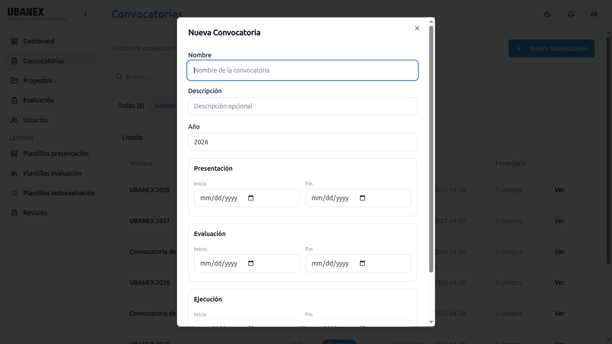

### 4.2 Formulario de presentación

En el detalle de la convocatoria, pestaña **Formulario** (Autoridad **o** Asistente de
Rectorado):

1. Podés partir de una **plantilla** (*Plantillas de presentación* en la barra lateral) o
   armarlo desde cero.
2. Agregá campos con el **builder**. Tipos disponibles: texto, texto largo, número, fecha,
   geolocalización, booleano, checkbox, select, usuario, tabla y sección (separador
   visual). El tipo *archivo* está deshabilitado por ahora.
3. Marcá cada campo como **obligatorio** u opcional. Para *tabla*, definí sus columnas y
   los mínimos/máximos de filas.
4. Guardá.

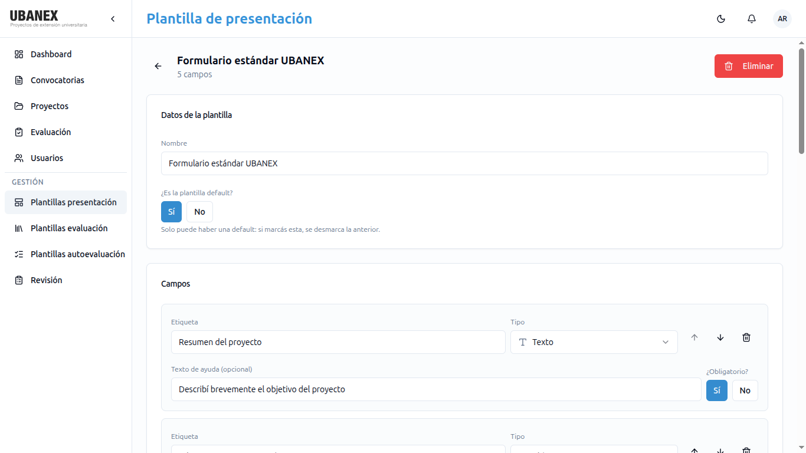

> El formulario **se congela** automáticamente cuando la convocatoria pasa a
> *Presentación*. Después de eso no se puede modificar.

### 4.3 Plantillas de evaluación y autoevaluación

Desde la barra lateral (solo Rectorado): **Plantillas de evaluación** (institucional y
cruzada) y **Plantillas de autoevaluación** de impacto. También se ajustan por
convocatoria desde su detalle:

- **Evaluación institucional:** categorías con subcategorías numéricas (suman puntaje) o
  booleanas (informativas), más un *checklist* que no suma.
- **Evaluación cruzada:** 5 categorías con ítems de puntaje máximo/asignado.
- **Autoevaluación de impacto:** preguntas de texto, booleano, escala numérica, select o
  checkbox.

Podés marcar una plantilla como **default** para reutilizarla en la próxima convocatoria.

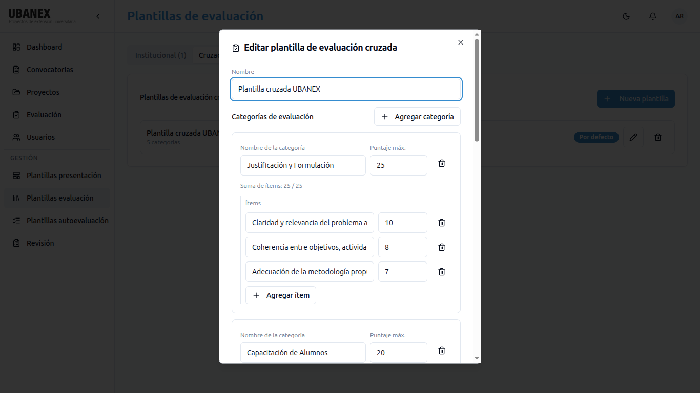

### 4.4 Emparejamiento de Unidades Académicas

En el detalle de la convocatoria, pestaña **Emparejamiento** (Autoridad o Asistente de
Rectorado): las 14 facultades se agrupan en **7 pares**. Cada UA queda emparejada con una
sola otra; esos pares definen quién hace la evaluación cruzada de quién.

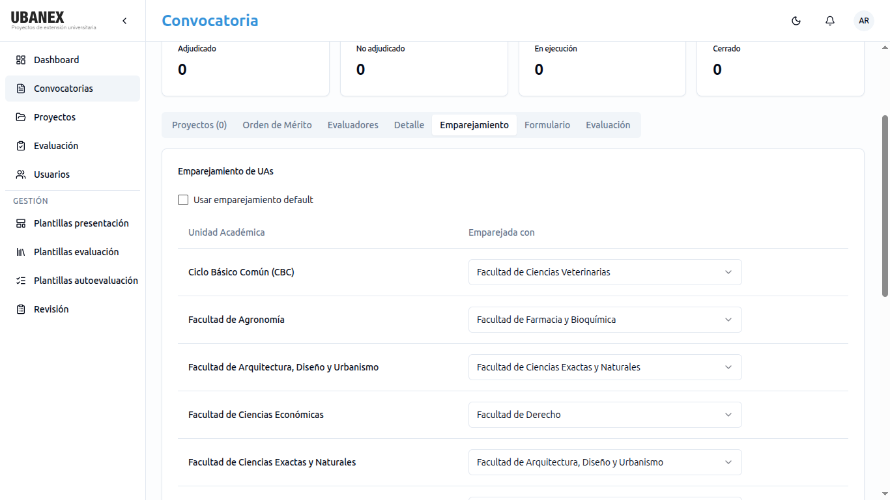

### 4.5 Avanzar de etapa

Desde el detalle de la convocatoria, con el control de **estado/etapa**, la hacés avanzar
a la siguiente. Al pasar a:

- **Presentación:** se congela el formulario; los directores ya pueden presentar.
- **Evaluación:** las ediciones presentadas entran a evaluación; los proyectos
  consolidados que saltean evaluación pasan directo a *Adjudicado*.
- **Ejecución:** se crea el Informe Final vacío de cada edición.

---

## 5. Rectorado — orden de mérito y adjudicación

Rol necesario: **Autoridad de Rectorado** para confirmar/emitir; el **Asistente** puede
generar y ajustar la propuesta, pero no confirmarla ni emitirla.

Se trabaja desde la barra lateral → **Evaluación**, eligiendo la convocatoria.

1. **Generar el orden de mérito.** Botón **Generar orden de mérito**. El sistema calcula
   la **nota final** de cada edición con evaluación confirmada y las ordena de mayor a
   menor (los proyectos consolidados encabezan la lista).
   - Requisito: cada edición necesita su evaluación **institucional**, la **propia** y la
     **ajena** confirmadas. Si hay una **inconsistencia** entre la propia y la ajena sin
     resolver (falta la tercera evaluación), no se puede generar ni confirmar.
2. **Revisar la propuesta de adjudicación.** El sistema arma un borrador limitado por el
   presupuesto total, aplicando la **cuota federativa** como piso por UA.
3. **Ajustar a mano** (opcional). Mientras no esté confirmado, podés cambiar montos o el
   mecanismo (mérito / cuota federativa) de una edición.
4. **Confirmar el orden de mérito.** Fija el resultado (ya no se regenera ni ajusta) y
   **notifica a cada director** si su proyecto quedó adjudicado o no.
5. **Emitir la resolución de adjudicación** (Autoridad de Rectorado). Es el acto formal
   posterior a la confirmación.

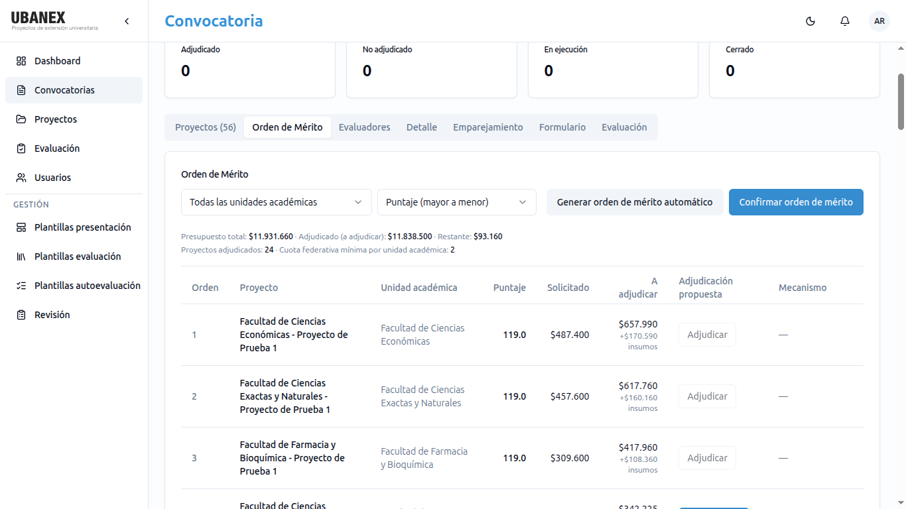

### Inconsistencia entre evaluaciones cruzadas

Si la evaluación **propia** y la **ajena** difieren en puntaje por encima del umbral de
la convocatoria, la edición se marca como *inconsistente*. Desde el detalle de esa
evaluación, Rectorado usa **Designar tercera UA** para elegir un evaluador de una tercera
facultad. Cuando esa tercera evaluación se confirma, **reemplaza** a la propia y la ajena
en el cálculo.

---

## 6. Secretaría de Extensión

Roles: **Autoridad de Secretaría** (puede confirmar) y **Asistente de Secretaría**
(completa, no confirma). Cada usuario de Secretaría pertenece a una UA y trabaja sobre los
proyectos y docentes de **su** facultad.

### 6.1 Validar docentes

Barra lateral → **Validación Docente**. Vas a ver los docentes de tu UA pendientes.
Para cada uno: **Validar** o **Rechazar**. Solo la **Autoridad** de Secretaría valida.

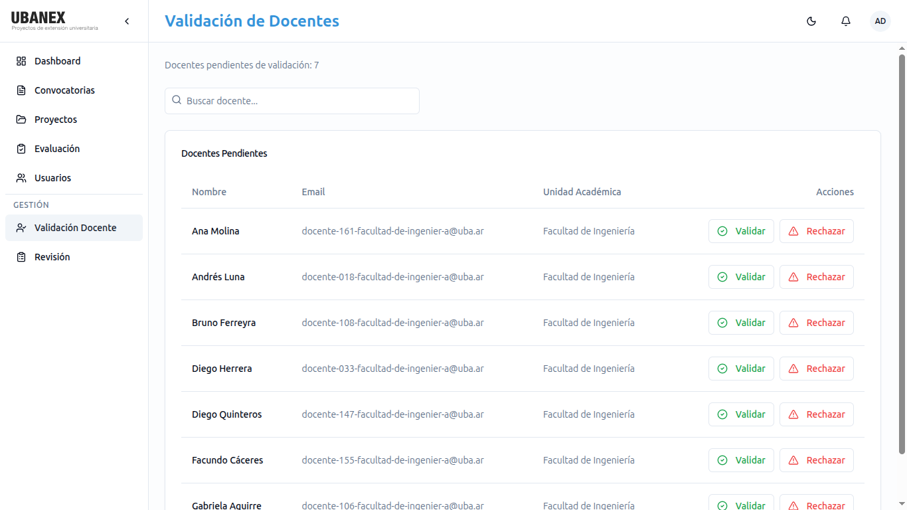

### 6.2 Cargar el aval de una edición

En el detalle de un proyecto de tu UA, pestaña **Resumen**: **cargar el aval** (link al
PDF firmado por el decano). Es requisito para adjudicar, pero no bloquea el pase a
evaluación.

### 6.3 Evaluación institucional

Barra lateral → **Evaluación** → pestaña de evaluaciones institucionales, o desde el
detalle del proyecto → **Evaluaciones**.

1. Abrí la evaluación de la edición.
2. Completá las **categorías/subcategorías** según la plantilla y el **checklist**.
3. Marcá **PSE** (Práctica Social Educativa) si corresponde — no suma puntaje, pero
   habilita un extra en el presupuesto a adjudicar.
4. Guardá como **Borrador** las veces que quieras.
5. Una **Autoridad** de Secretaría presiona **Confirmar**. A partir de ahí queda cerrada.

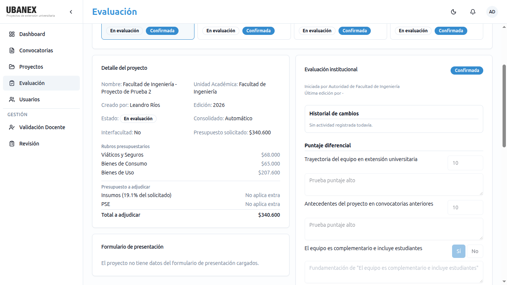

### 6.4 Sugerir cambios a una edición presentada

Ver §11.2. Solo sobre ediciones en estado **Presentado** y de tu misma UA.

### 6.5 Consultar hitos y evaluadores

- **Hitos de ejecución:** en el detalle del proyecto, pestaña **Hitos** — solo lectura
  para Secretaría.
- **Evaluadores de tu UA:** los podés consultar, pero el alta/baja lo hace Rectorado.

---

## 7. Director de Proyecto — presentar un proyecto

Rol necesario: **Docente validado**, asignado como Director en la convocatoria. El primer
director (principal) es obligatorio; se admite un segundo director (codirector) opcional.
Un usuario puede dirigir **como máximo 2 proyectos por convocatoria**.

### 7.1 Crear el proyecto y su edición

1. Barra lateral → **Proyectos** → **Nuevo proyecto**.
2. Completá el nombre del proyecto, si es **interfacultad**, y la **convocatoria** en la
   que lo presentás. Esto crea el **Proyecto** y su **Edición** de este año en estado
   **Borrador**.
3. Asigná el/los **directores** (mientras la edición esté en Borrador).

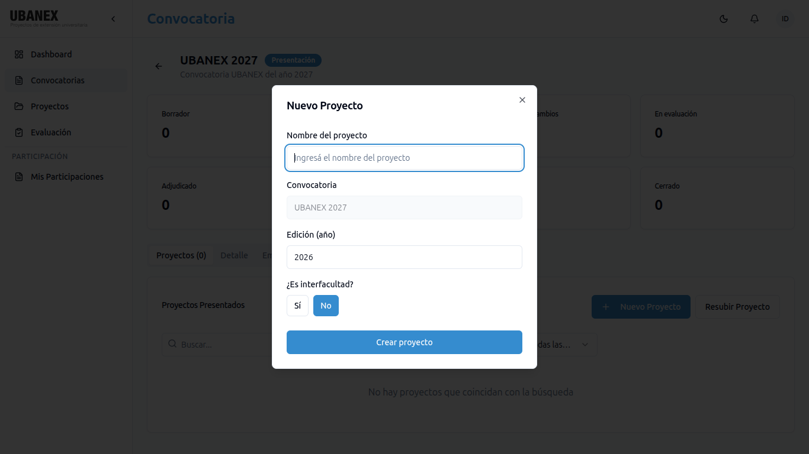

### 7.2 Completar el formulario y el presupuesto

En el detalle de la edición:

- **Pestañas de secciones / Resumen:** respondé los campos del formulario dinámico de la
  convocatoria. Los obligatorios se marcan; si falta alguno, no vas a poder enviar.
- **Dirección:** ubicación del proyecto (si el formulario lo pide).
- **Presupuesto solicitado:** cargá las partidas de los 3 rubros:
  - **Viáticos y Seguros** — por tipo de persona (Docente / Estudiante): descripción,
    período (dentro de las fechas de ejecución) y monto.
  - **Bienes de Consumo** y **Bienes de Uso** — descripción, cantidad, precio unitario;
    marcá **insumo** cuando corresponda.
  - El sistema **recalcula** subtotales y total automáticamente. Respetá el **tope** de
    presupuesto solicitado de la convocatoria.

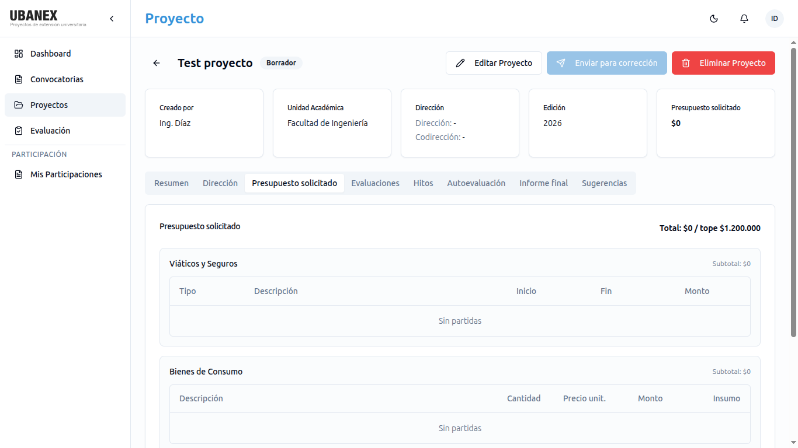

### 7.3 Enviar (presentar)

Botón **Enviar** / **Presentar**. La edición pasa de **Borrador** a **Presentado**.
Validaciones al enviar: campos obligatorios completos, presupuesto dentro del tope y bien
formado, fechas coherentes.

### 7.4 Responder observaciones y reenviar

Si la Secretaría te devuelve la edición con cambios, pasa a **Pendiente de cambios**.

1. Revisá las **sugerencias** (pestaña *Sugerencias*, ver §11.2) y/o los comentarios.
2. Corregí lo que haga falta.
3. Botón **Resubir** para volver a **Presentado**.

---

## 8. Director de Proyecto — ejecución y cierre

Disponible cuando la edición está **En ejecución** (tras la adjudicación) y la
convocatoria está en etapa *Ejecución*.

### 8.1 Registrar hitos

Detalle del proyecto → pestaña **Hitos** → **Nuevo hito**.

- **Título** (obligatorio), **categoría** (Organización, Capacitación, Actividad con la
  comunidad, Articulación, Difusión, Informe parcial), **fecha de inicio/fin** (dentro del
  período de ejecución), **integrantes** (texto libre) y **descripción**.
- **Links:** agregá uno o más enlaces para mostrar avances (fotos, documentos,
  publicaciones). Con **Agregar link** sumás un campo; la ✕ lo quita. Si escribís el link
  sin `https://`, el sistema lo completa solo. En la tabla, los links quedan clickeables.

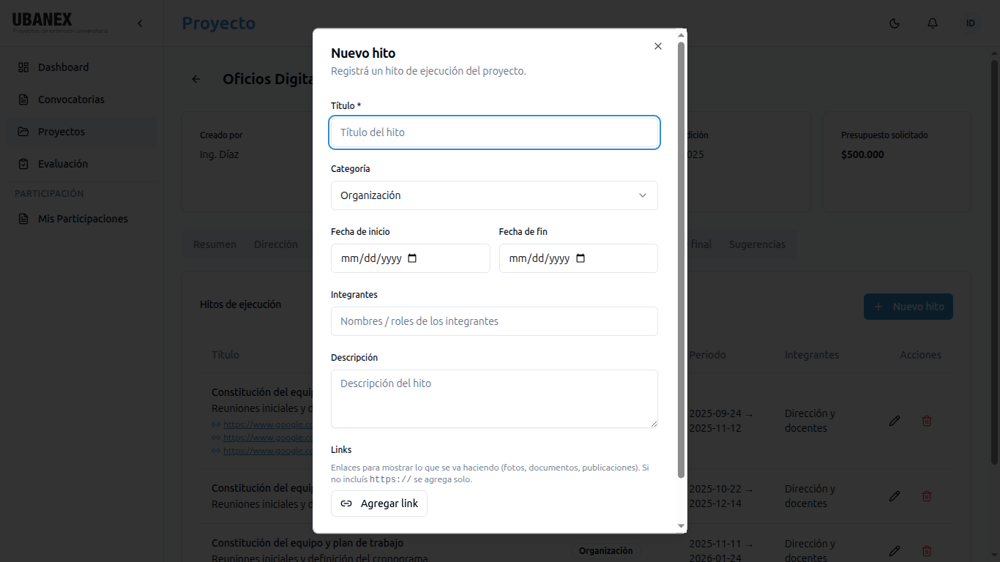

Podés **editar** o **eliminar** un hito mientras la edición siga en ejecución. Los hitos
solo los ven el director, la Secretaría de la UA y Rectorado.

### 8.2 Autoevaluación de impacto

Pestaña **Autoevaluación**. Respondé el cuestionario de la convocatoria. Se puede guardar
como **Borrador** y retomar. Cuando esté lista, **Completar**.

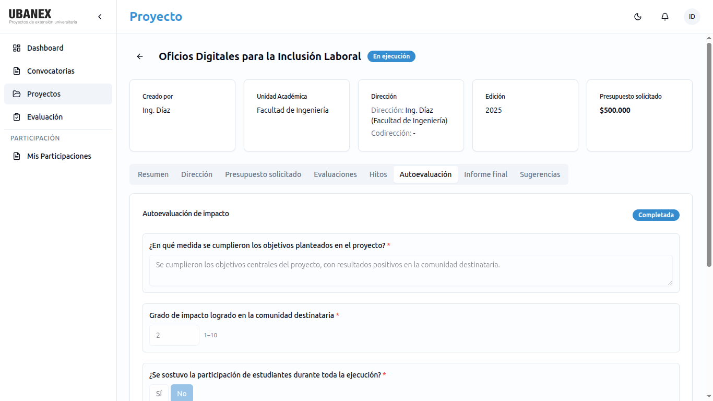

### 8.3 Informe final

Pestaña **Informe final**. El sistema genera un **borrador** a partir de tus hitos. Editá
el texto libremente y, si querés, adjuntá un PDF (como link). Cuando esté listo,
**Confirmar** — queda como registro definitivo.

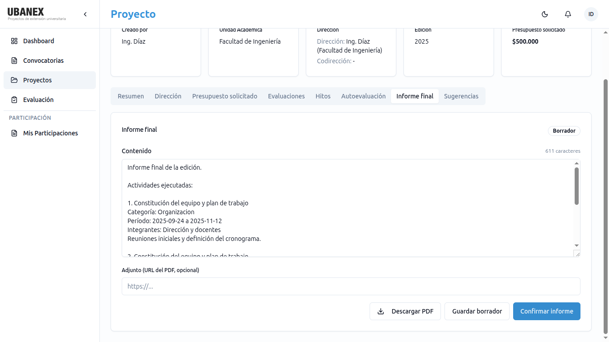

### 8.4 Rendición

> **En construcción.** El circuito de comprobantes de rendición todavía no está
> disponible en la aplicación; por ahora la rendición se sigue gestionando por fuera del
> sistema.

---

## 9. Evaluador

Rol necesario: **Docente validado**, dado de alta como **Evaluador** en la convocatoria
por una Autoridad de Rectorado. Recibís una notificación (in-app + mail) al ser asignado;
no hay que aceptar nada.

- No podés evaluar tu propio proyecto ni uno en el que participes.
- Evaluás proyectos de tu UA y de la UA emparejada. Cada proyecto recibe una sola
  evaluación por UA.

### Cargar una evaluación cruzada

1. Barra lateral → **Evaluación** → **Evaluaciones cruzadas disponibles**.
2. Elegí un proyecto y abrí su evaluación.
3. Cargá el **puntaje asignado** en cada ítem de las 5 categorías. Abajo se muestra el
   **cuadro de puntuación** con los totales (calculado).
4. Dejá **observaciones** si corresponde.
5. **Guardá** como borrador cuanto necesites y, al terminar, **Confirmá** vos mismo la
   evaluación (no requiere autoridad superior).

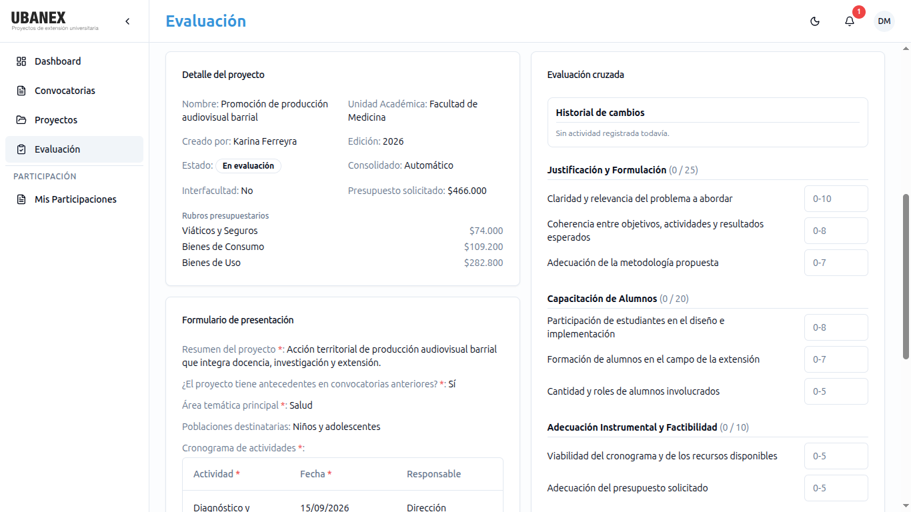

---

## 10. Estudiante

- Te registrás por tu cuenta, sin validación.
- Barra lateral → **Mis Participaciones**: proyectos en los que participás.
- Acceso de **solo lectura** a esos proyectos. No creás proyectos ni evaluás.

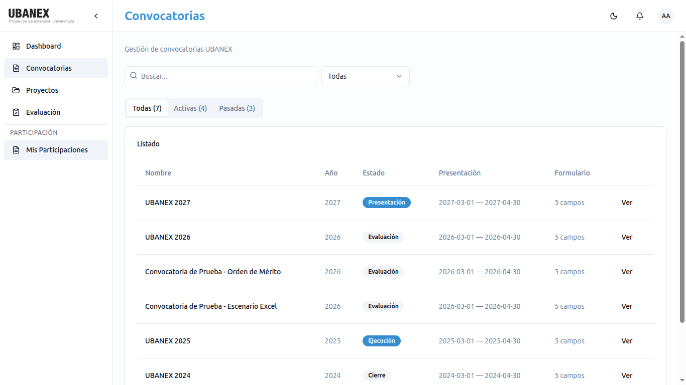

---

## 11. Notificaciones y sugerencias de cambio

### 11.1 Notificaciones

La 🔔 del header muestra los avisos in-app: nueva sugerencia sobre tu edición, respuesta a
una sugerencia que hiciste, alta como evaluador y resultado de la adjudicación. Podés
marcarlas como leídas (una o todas) o eliminarlas. El alta como evaluador llega además
por mail.

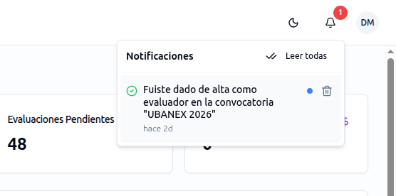

### 11.2 Sugerencias de cambio

Es el canal para pedir correcciones sobre una edición **ya presentada**.

**Quién crea** (Secretaría de la misma UA o Rectorado), sobre ediciones en estado
**Presentado**:

1. En el detalle del proyecto, ubicá el campo a corregir y usá **Sugerir cambio**
   (o la pestaña **Sugerencias**).
2. Indicá el **valor sugerido** y un **comentario**.

**Quién responde** (el creador de la edición o sus directores):

1. Pestaña **Sugerencias** → cada sugerencia pendiente.
2. Elegí **Aceptar** (el sistema aplica el cambio automáticamente), **Rechazar** o
   **Pedir más información**.
3. La respuesta es **única y definitiva**: la sugerencia queda cerrada. Para seguir la
   conversación, se crea una sugerencia nueva.

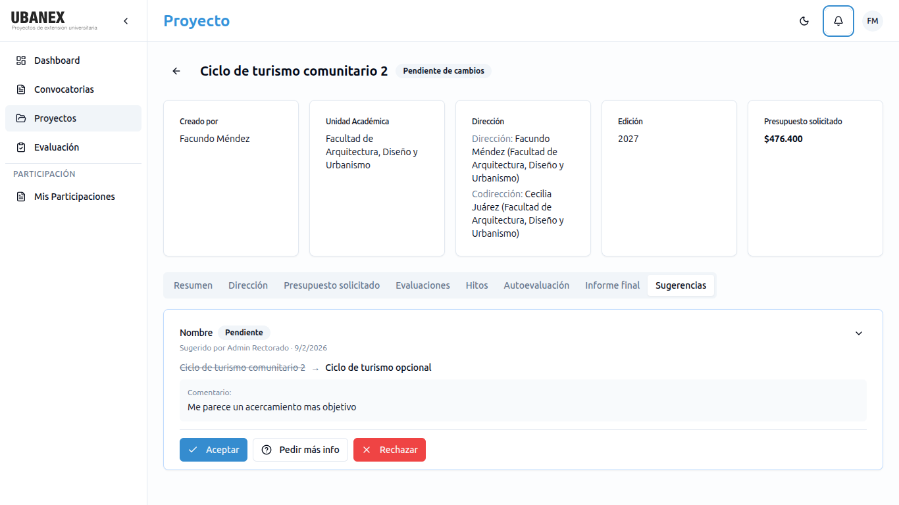

---

## 12. Preguntas frecuentes

**No puedo iniciar sesión siendo docente.**
Puede que tu cuenta esté *Pendiente de validación* o *Rechazada*. Contactá a la Secretaría
de Extensión de tu facultad.

**No veo el botón para crear un proyecto.**
Tenés que ser **Docente validado** y estar dentro de la convocatoria como Director. Los
estudiantes y los roles de gestión no crean proyectos.

**Cambié un campo del formulario de la convocatoria y no se guarda.**
El formulario solo se edita en etapa **Configuración**. Una vez en *Presentación* queda
congelado.

**Generé el orden de mérito pero una edición no aparece.**
Le falta alguna evaluación confirmada (institucional, propia o ajena), o hay una
inconsistencia sin resolver.

**La aplicación tardó mucho en abrir.**
El entorno de producción "se duerme" por inactividad; la primera carga puede demorar hasta
un minuto.

**¿Puedo dirigir más de dos proyectos en la misma convocatoria?**
No. El límite es 2 participaciones como director por convocatoria.

