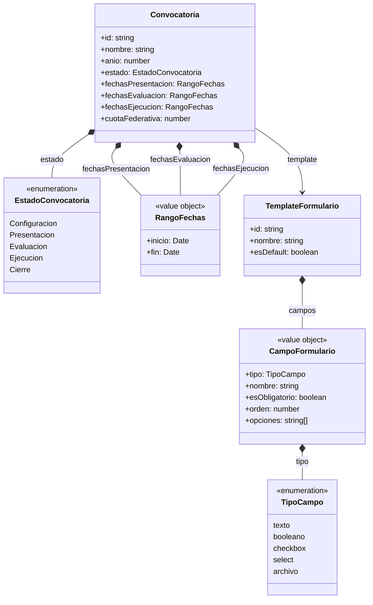
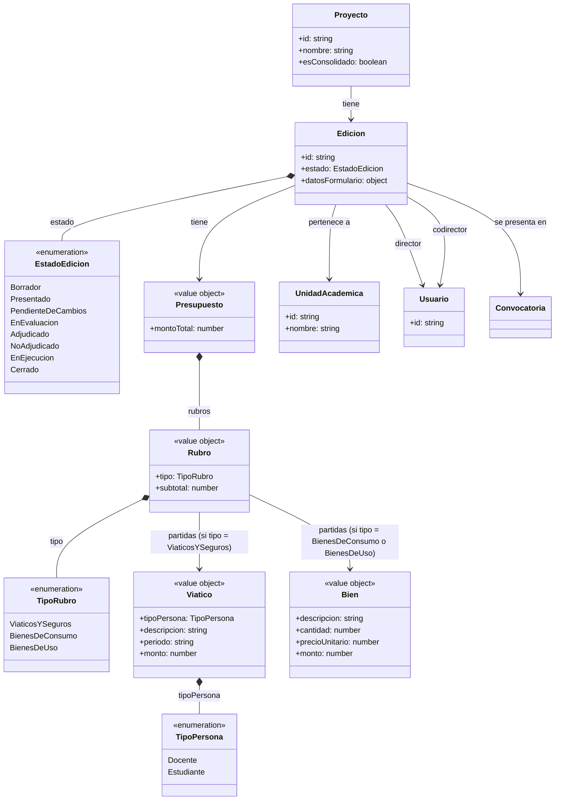
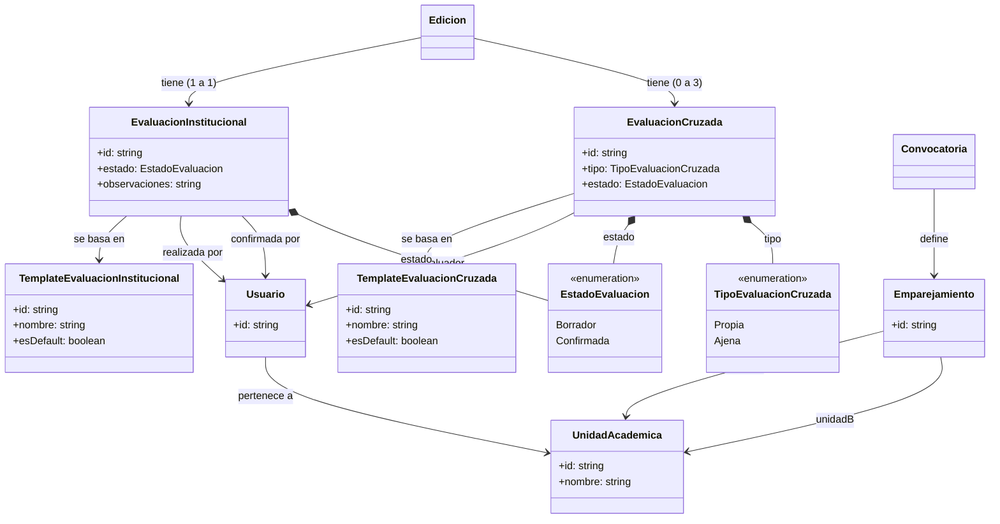
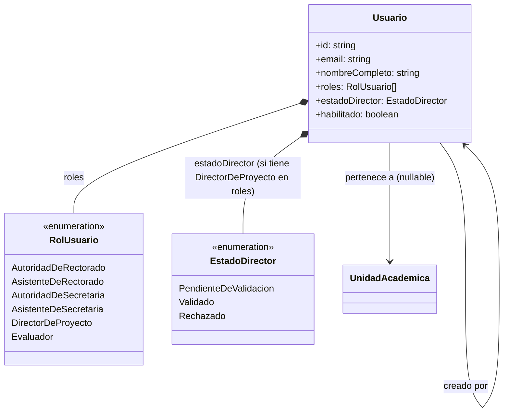
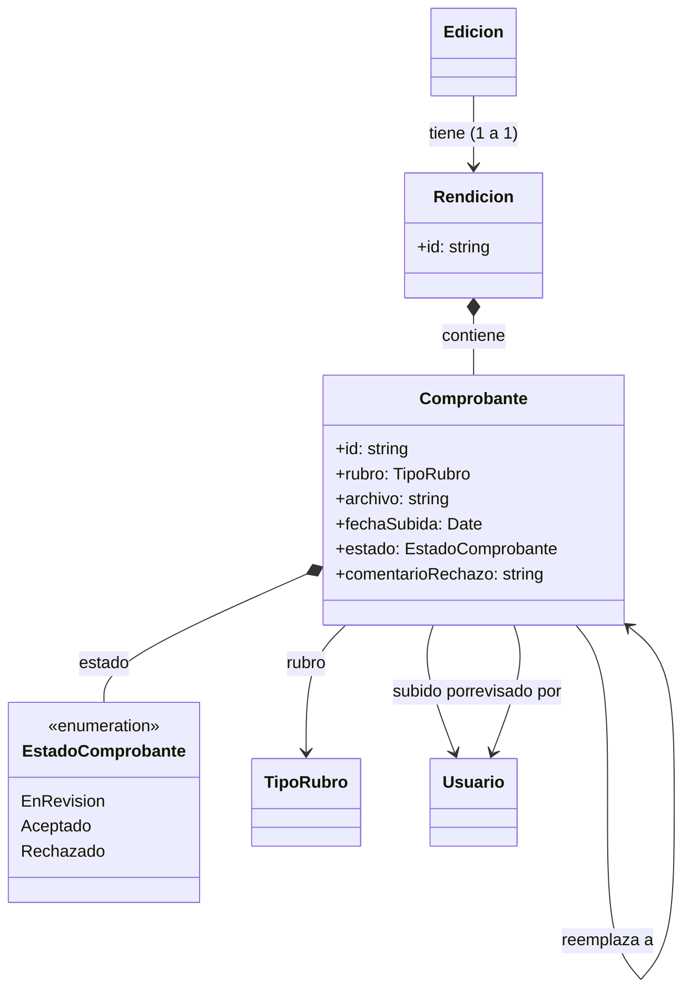
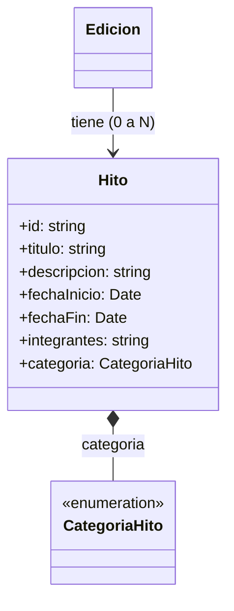
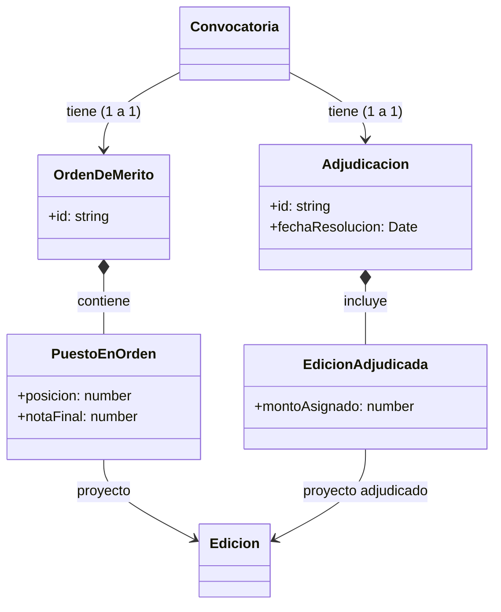
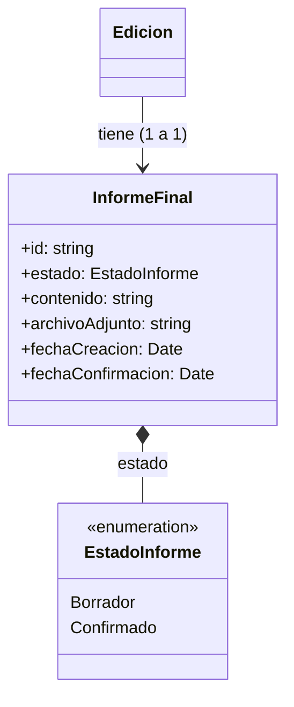
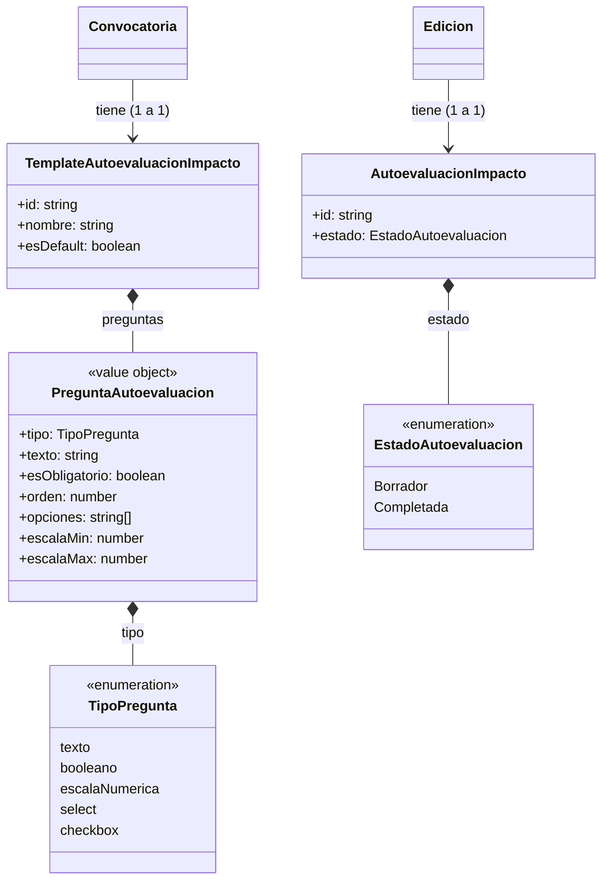

# Modelo de Dominio — UBANEX

## Convocatoria

### Notas

- Las etapas de la convocatoria son siempre las mismas 5 (`Configuracion`, `Presentacion`, `Evaluacion`, `Ejecucion`, `Cierre`) y se corresponden 1 a 1 con el estado actual.
- Solo `Presentacion`, `Evaluacion` y `Ejecucion` tienen fechas de inicio y fin predefinidas (value object `RangoFechas`).
- `Configuracion` y `Cierre` no tienen fechas asociadas.
- `TemplateFormulario` define los campos dinámicos del formulario de presentación. Puede reutilizarse entre convocatorias (`esDefault`).
- Un `CampoFormulario` puede tener `opciones` solo cuando su `tipo` es `checkbox` o `select`.
- `cuotaFederativa` define el mínimo de proyectos a adjudicar por unidad académica en esa convocatoria.

---

## Proyecto y Edición

### Notas

- `Proyecto` es una entidad raíz con datos estables que persisten entre años (ej: nombre, `esConsolidado`).
- `esConsolidado = true` indica que el proyecto tiene el mismo equipo directivo 2 años consecutivos. Su Edición saltea la etapa `Evaluacion` en la convocatoria actual.
- `Edicion` representa la instancia de un proyecto dentro de una convocatoria específica. Un proyecto puede tener múltiples ediciones a lo largo del tiempo.
- El estado `NoAdjudicado` es terminal (no hay suplencia).
- El `Presupuesto` se compone de exactamente 3 rubros fijos: `ViaticosYSeguros`, `BienesDeConsumo` y `BienesDeUso`.
- `Viatico` tiene un `tipoPersona` (Docente o Estudiante). Ambos tipos suman al subtotal del rubro `ViaticosYSeguros`.
- `Edicion` tiene un `director` (obligatorio) y un `codirector` (opcional), ambos de tipo `Usuario` con rol `DirectorDeProyecto`.

---

## Evaluación

### Notas

- `UnidadAcademica` representa cada una de las 14 facultades de la UBA.
- El `Emparejamiento` define pares de unidades académicas por convocatoria. Con 14 unidades resultan exactamente 7 parejas. Cada unidad solo está emparejada con otra única.
- Cada `Edicion` recibe:
  - **1** evaluación institucional (realizada por la Secretaría de Extensión de su UA).
  - **0 a 3** evaluaciones cruzadas (propia + ajena + eventual tercera UA de resolución).
- `EvaluacionInstitucional` y `EvaluacionCruzada` tienen estado `Borrador | Confirmada`.
- La confirmación de `EvaluacionInstitucional` la realiza un usuario con rol autoridad de la Secretaría. La de `EvaluacionCruzada` la confirma el propio evaluador.

#### Estructura de TemplateEvaluacionInstitucional

- **Categorías** configurables por convocatoria (default: "Puntaje diferencial", "Articulación del proyecto"). Cada categoría contiene **subcategorías** con:
  - nombre / texto del criterio
  - tipo de valor (numérico con mínimo y máximo, o booleano) — excluyentes
  - fundamentación opcional (texto)
- **Checklist** — sección aparte de ítems booleanos que no suma a la ponderación final. Es independiente de las categorías.

#### Estructura de TemplateEvaluacionCruzada

- **5 categorías** configurables por convocatoria (default: Justificación y Formulación 25pts, Capacitación de Alumnos 20pts, Adecuación Instrumental y Factibilidad 10pts, Vinculación con el Medio 12pts, Impacto Social 15pts).
- Cada categoría contiene **ítems** con nombre, puntaje máximo y puntaje asignado.
- Al final se muestra un **cuadro de puntuación** con categorías, puntajes máximos y puntajes asignados, más la **ponderación final** (suma de máximos y suma de asignados). Este cuadro es calculado, no almacenado.

---

## Usuarios y Roles

### Notas

- **Rectorado**: 1 a 3 Autoridades, 0 a N Asistentes. No pertenecen a ninguna UA.
- **Secretaría de Extensión**: 1 a 3 Autoridades, 0 a N Asistentes por UA. Cada usuario de Secretaría pertenece a una UA específica.
- **Director de Proyecto**: 0 a N. Se registra solo, requiere validación por Autoridad de Secretaría de su UA. Puede estar asignado a una `Edicion` como director o codirector. Máximo 2 proyectos por convocatoria (1 como director + 1 como codirector).
- **Evaluador**: 0 a N por UA. Creado por Autoridad de Secretaría de dicha UA.
- Un usuario puede acumular múltiples roles a lo largo del tiempo (ej: fue DirectorDeProyecto en una convocatoria y luego Evaluador en otra), pero todos deben pertenecer al mismo **grupo**:
  - **Gestión**: AutoridadDeRectorado, AsistenteDeRectorado, AutoridadDeSecretaria, AsistenteDeSecretaria
  - **Ejecución**: DirectorDeProyecto, Evaluador
  - Es **regla de negocio** excluyente: no se pueden mezclar roles de gestión con roles de ejecución.
- `estadoDirector` solo aplica cuando el usuario tiene `DirectorDeProyecto` en sus roles (PendienteDeValidacion → Validado | Rechazado).
- `creadoPor` referencia al Usuario que creó la cuenta (aplica para Evaluadores y Asistentes).

---

## Rendición

### Notas

- Una única `Rendicion` por `Edicion`. Activa durante la etapa `Ejecucion` de la convocatoria.
- El director y/o codirector suben `Comprobante`s (archivos PDF o imagen), cada uno asociado a un rubro del presupuesto.
- Cada comprobante tiene un estado individual: `EnRevision → Aceptado | Rechazado`.
- Cuando un usuario de rectorado rechaza un comprobante, puede dejar un `comentarioRechazo` explicativo. El director puede subir un nuevo comprobante que reemplace al rechazado (relación `reemplaza a`).
- `Rendicion` no tiene estado global — se considera "en curso" mientras la convocatoria esté en `Ejecucion`.

---

## Seguimiento de Ejecución

### Notas

- Los directores registran `Hito`s durante la etapa `Ejecucion` para documentar las actividades realizadas con su equipo.
- `CategoriaHito` es un enumerado fijo (valores por definir).
- `integrantes` es texto libre (nombres de estudiantes y colaboradores), no referencia a `Usuario`.
- El director puede editar o eliminar hitos mientras la edición esté en etapa `Ejecucion`.
- Visibilidad: solo usuarios de la Secretaría de la UA correspondiente y de Rectorado pueden consultar los hitos de un proyecto.

---

## Adjudicación y Orden de Mérito

### Notas

- `OrdenDeMerito` se genera automáticamente al finalizar la etapa `Evaluacion`. Ordena todos los proyectos evaluados por `notaFinal` descendente.
- La `notaFinal` se calcula combinando la evaluación institucional (1) y las evaluaciones cruzadas (2). La fórmula exacta se definirá posteriormente.
- Los proyectos con `esConsolidado = true` aparecen primeros en el orden de mérito, ordenados por nota final entre sí.
- `Adjudicacion` es la resolución formal emitida por Rectorado que selecciona proyectos del orden de mérito y les asigna un monto.
- `cuotaFederativa` actúa como piso: si al aplicar el orden de mérito una UA tiene menos proyectos adjudicados que la cuota, se toman los siguientes mejores proyectos de esa UA aunque tengan menor nota que otros de UAs que ya superaron la cuota.

---

## Cierre

### Notas

- Cuando la convocatoria pasa a `Ejecucion`, se crea un `InformeFinal` vacío asociado a cada `Edicion`.
- El sistema autogenera el `contenido` inicial a partir de los hitos registrados durante la ejecución. El director puede editarlo libremente y opcionalmente adjuntar un `archivoAdjunto` (PDF).
- Cuando la convocatoria pasa a `Cierre`, se exige que el `InformeFinal` esté `Confirmado` **y** que la `AutoevaluacionImpacto` esté `Completada` para que la `Edicion` pase a `Cerrado`.
- Una vez confirmado, queda como registro definitivo (nadie lo aprueba).

---

## Autoevaluación de Impacto

### Notas

- `TemplateAutoevaluacionImpacto` es configurable por convocatoria (creado por Rectorado), con `esDefault` para reutilizar entre convocatorias.
- Cada pregunta puede ser de tipo `texto`, `booleano`, `escalaNumerica` (con mínimo y máximo por pregunta), `select` o `checkbox` (con `opciones` predefinidas).
- La completa el director o codirector de la Edición durante la etapa `Ejecucion`. Puede guardarse como `Borrador` y retomarse después.
- Es requisito obligatorio para el cierre: la Edición no pasa a `Cerrado` hasta que la autoevaluación esté `Completada`.
