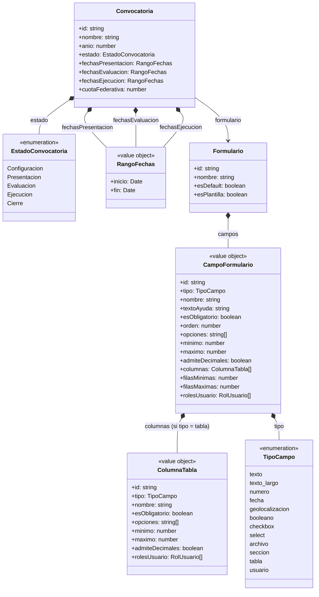
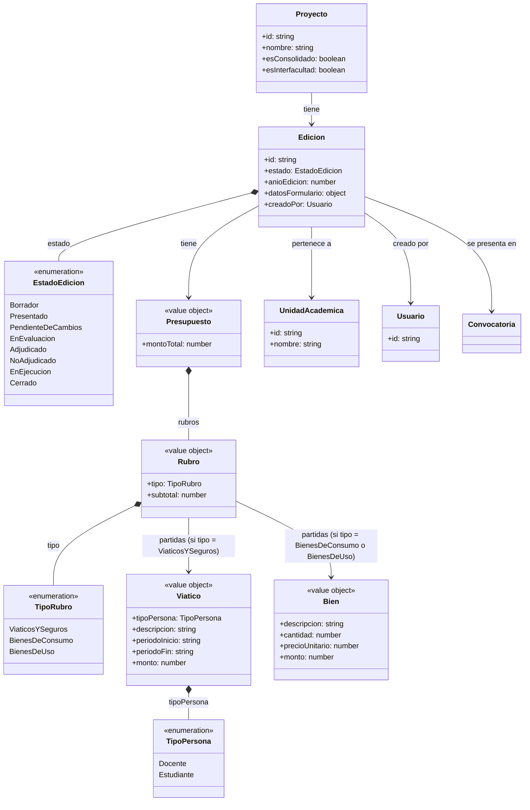
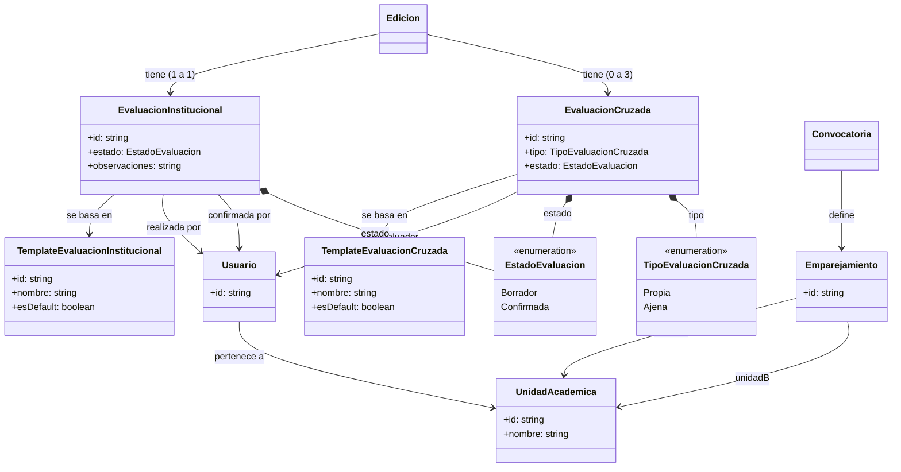
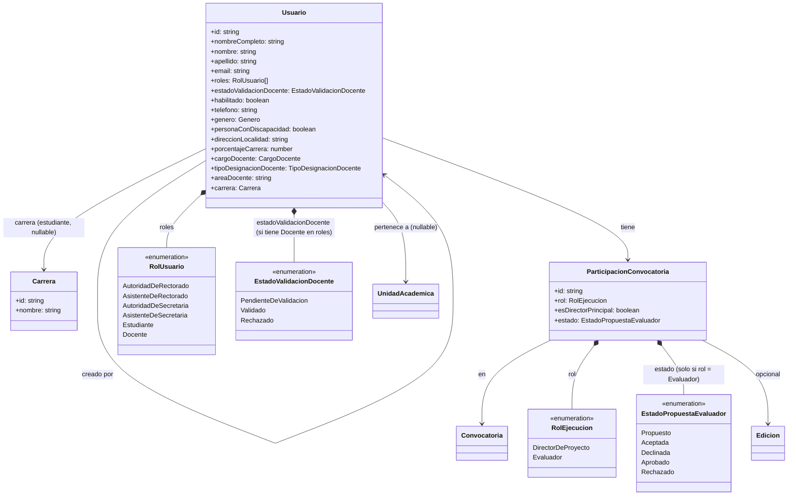
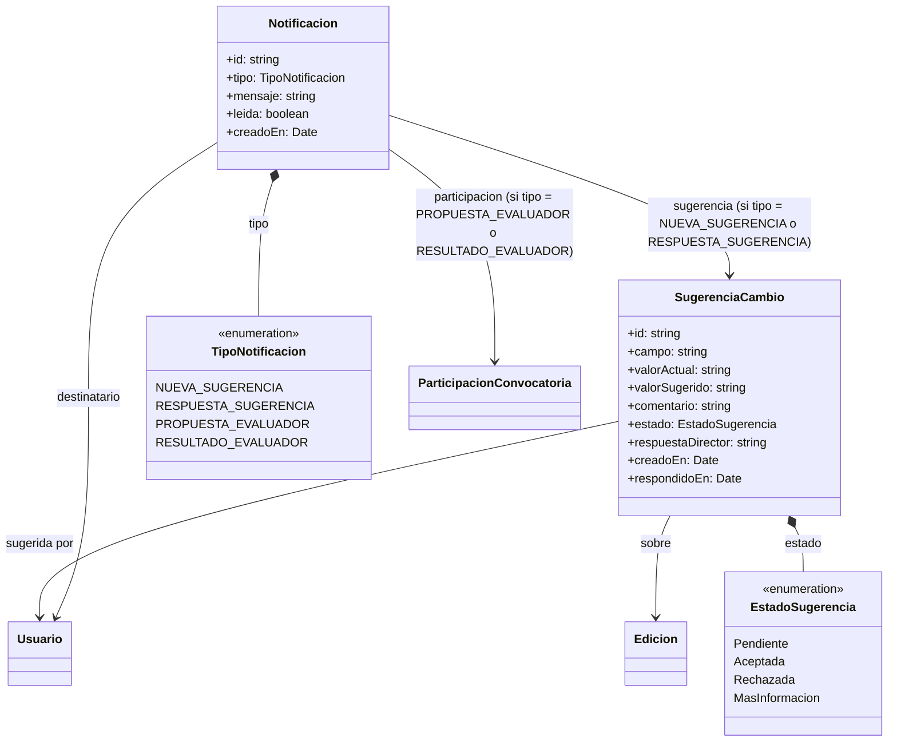
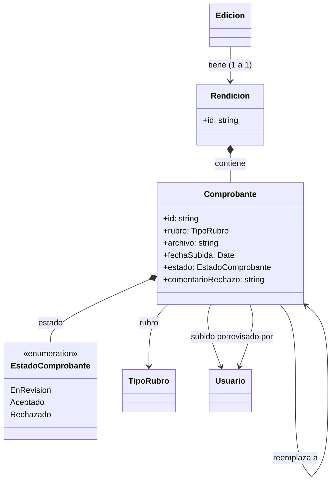
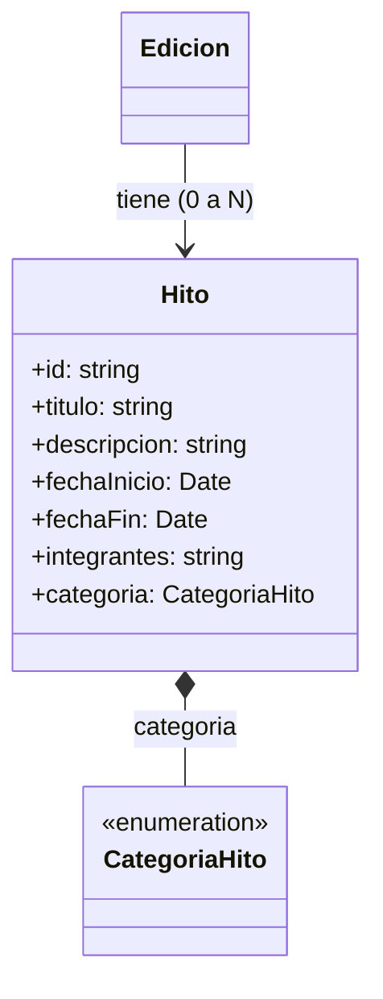
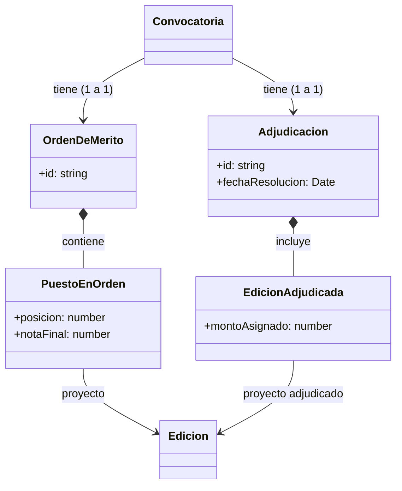
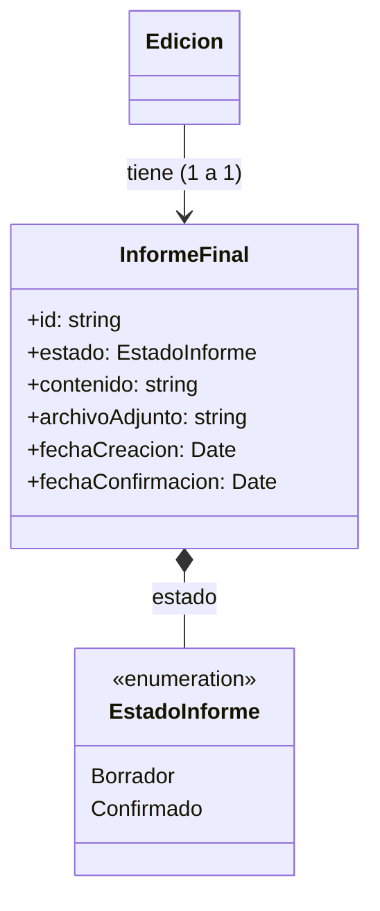
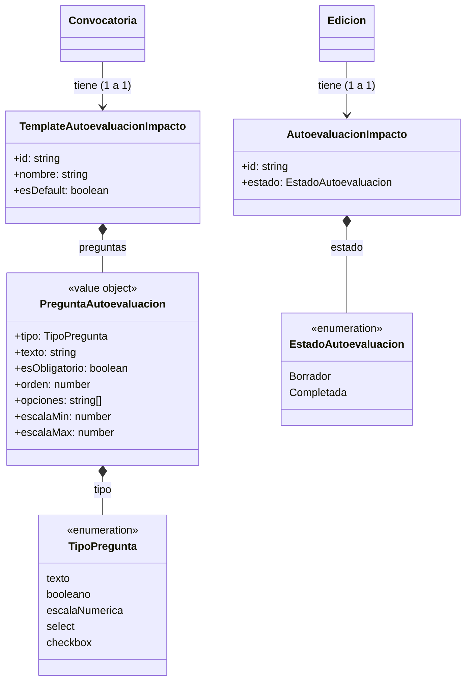

# Modelo de Dominio — UBANEX

## Convocatoria

```mermaid
classDiagram
    class Convocatoria {
        +id: string
        +nombre: string
        +anio: number
        +estado: EstadoConvocatoria
        +fechasPresentacion: RangoFechas
        +fechasEvaluacion: RangoFechas
        +fechasEjecucion: RangoFechas
        +cuotaFederativa: number
    }

    class EstadoConvocatoria {
        <<enumeration>>
        Configuracion
        Presentacion
        Evaluacion
        Ejecucion
        Cierre
    }

    class RangoFechas {
        <<value object>>
        +inicio: Date
        +fin: Date
    }

    class Formulario {
        +id: string
        +nombre: string
        +esDefault: boolean
        +esPlantilla: boolean
    }

    class CampoFormulario {
        <<value object>>
        +id: string
        +tipo: TipoCampo
        +nombre: string
        +textoAyuda: string
        +esObligatorio: boolean
        +orden: number
        +opciones: string[]
        +minimo: number
        +maximo: number
        +admiteDecimales: boolean
        +columnas: ColumnaTabla[]
        +filasMinimas: number
        +filasMaximas: number
        +rolesUsuario: RolUsuario[]
    }

    class ColumnaTabla {
        <<value object>>
        +id: string
        +tipo: TipoCampo
        +nombre: string
        +esObligatorio: boolean
        +opciones: string[]
        +minimo: number
        +maximo: number
        +admiteDecimales: boolean
        +rolesUsuario: RolUsuario[]
    }

    class TipoCampo {
        <<enumeration>>
        texto
        texto_largo
        numero
        fecha
        geolocalizacion
        booleano
        checkbox
        select
        archivo
        seccion
        tabla
        usuario
    }

    CampoFormulario *-- ColumnaTabla : columnas (si tipo = tabla)

    Convocatoria *-- EstadoConvocatoria : estado
    Convocatoria *-- RangoFechas : fechasPresentacion
    Convocatoria *-- RangoFechas : fechasEvaluacion
    Convocatoria *-- RangoFechas : fechasEjecucion
    Convocatoria --> Formulario : formulario
    Formulario *-- CampoFormulario : campos
    CampoFormulario *-- TipoCampo : tipo
```

### Notas

- Las etapas de la convocatoria son siempre las mismas 5 (`Configuracion`, `Presentacion`, `Evaluacion`, `Ejecucion`, `Cierre`) y se corresponden 1 a 1 con el estado actual.
- Solo `Presentacion`, `Evaluacion` y `Ejecucion` tienen fechas de inicio y fin predefinidas (value object `RangoFechas`).
- `Configuracion` y `Cierre` no tienen fechas asociadas.
- `Formulario` es la definición de los campos dinámicos del formulario de presentación (no se llama `TemplateFormulario` como el resto de los templates del dominio porque, a diferencia de ellos, no tiene una entidad hermana que guarde las respuestas — las respuestas de cada proyecto se guardan directamente en `Edicion.datosFormulario`). `esPlantilla: true` marca los formularios de biblioteca, reutilizables, que se pueden usar como punto de partida; `esPlantilla: false` es el formulario privado de una convocatoria. `esDefault` indica, entre las plantillas, cuál se sugiere primero — hay a lo sumo una.
- Aunque `CampoFormulario` es un value object, lleva un `id` estable: es la clave con la que se guardan las respuestas en `Edicion.datosFormulario`, y debe sobrevivir a que se renombre la etiqueta (`nombre`) del campo más adelante. Por eso, al copiar los campos de una plantilla a una convocatoria, cada `CampoFormulario.id` se regenera: así las respuestas de una convocatoria nunca se confunden con las de otra que partió de la misma plantilla.
- `Edicion.datosFormulario` es un objeto cuyas claves son los `CampoFormulario.id` del `Formulario` de la convocatoria correspondiente.
- Un `CampoFormulario` puede tener `opciones` solo cuando su `tipo` es `checkbox` o `select`; `minimo`/`maximo`/`admiteDecimales` para `numero`; `rolesUsuario` para `usuario`.
- El `tipo` `archivo` está contemplado en `TipoCampo` pero no está disponible para usarse hasta que exista un mecanismo de almacenamiento de adjuntos (lo mismo aplica a `seccion`, que solo es un separador visual).
- `geolocalizacion` y `usuario` guardan un valor objeto y viajan serializados por columnas de texto (`TIPOS_VALOR_OBJETO`). El campo `usuario` se completa buscando docentes/estudiantes por nombre; `geolocalizacion` consulta localidades (módulo `geo`).
- Un campo `tabla` contiene `columnas` tipadas (cada una con su propio `TipoCampo`), con `filasMinimas`/`filasMaximas`. Al enviar la edición se exige completar las filas y columnas marcadas como obligatorias.
- El `Formulario` de una convocatoria solo puede editarse (agregar, quitar o modificar `CampoFormulario`) mientras la convocatoria esté en estado `Configuracion`. Al pasar a `Presentacion` queda congelado.
- Tanto `AutoridadDeRectorado` como `AsistenteDeRectorado` pueden configurar el `Formulario` de una convocatoria.
- El `Formulario` de una convocatoria es siempre propio (`esPlantilla: false`) y se crea recién la primera vez que se guardan campos; hasta ese momento la convocatoria no tiene formulario asociado. Elegir una plantilla como punto de partida copia sus `CampoFormulario` (con `id` regenerados) sin referenciar ni modificar la plantilla original, y esos campos se siguen editando libremente antes de guardar.
- `cuotaFederativa` define el mínimo de proyectos a adjudicar por unidad académica en esa convocatoria.

---

## Proyecto y Edición

```mermaid
classDiagram
    class Proyecto {
        +id: string
        +nombre: string
        +esConsolidado: boolean
        +esInterfacultad: boolean
    }

    class Edicion {
        +id: string
        +estado: EstadoEdicion
        +anioEdicion: number
        +datosFormulario: object
        +creadoPor: Usuario
    }

    class EstadoEdicion {
        <<enumeration>>
        Borrador
        Presentado
        PendienteDeCambios
        EnEvaluacion
        Adjudicado
        NoAdjudicado
        EnEjecucion
        Cerrado
    }

    class Presupuesto {
        <<value object>>
        +montoTotal: number
    }

    class Rubro {
        <<value object>>
        +tipo: TipoRubro
        +subtotal: number
    }

    class TipoRubro {
        <<enumeration>>
        ViaticosYSeguros
        BienesDeConsumo
        BienesDeUso
    }

    class Viatico {
        <<value object>>
        +tipoPersona: TipoPersona
        +descripcion: string
        +periodoInicio: string
        +periodoFin: string
        +monto: number
    }

    class Bien {
        <<value object>>
        +descripcion: string
        +cantidad: number
        +precioUnitario: number
        +monto: number
    }

    class TipoPersona {
        <<enumeration>>
        Docente
        Estudiante
    }

    class UnidadAcademica {
        +id: string
        +nombre: string
    }

    class Usuario {
        +id: string
    }

    Edicion --> Convocatoria : se presenta en
    Edicion --> UnidadAcademica : pertenece a
    Edicion --> Usuario : creado por
    Proyecto --> Edicion : tiene
    Edicion --> Presupuesto : tiene
    Edicion *-- EstadoEdicion : estado
    Presupuesto *-- Rubro : rubros
    Rubro *-- TipoRubro : tipo
    Rubro --> Viatico : partidas (si tipo = ViaticosYSeguros)
    Rubro --> Bien : partidas (si tipo = BienesDeConsumo o BienesDeUso)
    Viatico *-- TipoPersona : tipoPersona
```

### Notas

- `Proyecto` es una entidad raíz con datos estables que persisten entre años (ej: nombre, `esConsolidado`, `esInterfacultad`).
- `esConsolidado = true` indica que el proyecto tiene el mismo equipo directivo 2 años consecutivos. Su Edición saltea la etapa `Evaluacion` en la convocatoria actual.
- `esInterfacultad = true` indica que el proyecto involucra a más de una unidad académica. Es un dato autodeclarado al crear el proyecto; no tiene reglas de negocio asociadas todavía.
- `Edicion` representa la instancia de un proyecto dentro de una convocatoria específica. Un proyecto puede tener múltiples ediciones a lo largo del tiempo.
- El estado `NoAdjudicado` es terminal (no hay suplencia).
- El `Presupuesto` se compone de exactamente 3 rubros fijos: `ViaticosYSeguros`, `BienesDeConsumo` y `BienesDeUso`.
- `Viatico` tiene un `tipoPersona` (Docente o Estudiante). Ambos tipos suman al subtotal del rubro `ViaticosYSeguros`.
- Las partidas de presupuesto no pueden tener montos negativos, y cada rubro presenta un reporte solo si tiene al menos una partida por completo (todos sus campos obligatorios completos).
- El backend recalcula siempre los subtotales por rubro y el total (ignora los montos que envía el front), así que el total es la suma exacta de las partidas.
- Un `Viatico` lleva `periodoInicio` y `periodoFin` (fechas que deben caer dentro del rango de `fechasEjecucion` de la convocatoria).
- Las sugerencias de cambio de presupuesto (así como las de demás campos de la edición) se implementan con el patrón de ediciones entrantes (ver sección Sugerencias).
- `Edicion` tiene un `creadoPor` (usuario que creó la edición). Los directores se asignan mediante `ParticipacionConvocatoria` con rol `DirectorDeProyecto`.

---

## Evaluación

```mermaid
classDiagram
    class UnidadAcademica {
        +id: string
        +nombre: string
    }

    class Emparejamiento {
        +id: string
    }

    class TemplateEvaluacionInstitucional {
        +id: string
        +nombre: string
        +esDefault: boolean
    }

    class TemplateEvaluacionCruzada {
        +id: string
        +nombre: string
        +esDefault: boolean
    }

    class EvaluacionInstitucional {
        +id: string
        +estado: EstadoEvaluacion
        +observaciones: string
    }

    class EvaluacionCruzada {
        +id: string
        +tipo: TipoEvaluacionCruzada
        +estado: EstadoEvaluacion
    }

    class EstadoEvaluacion {
        <<enumeration>>
        Borrador
        Confirmada
    }

    class TipoEvaluacionCruzada {
        <<enumeration>>
        Propia
        Ajena
    }

    class Usuario {
        +id: string
    }

    Convocatoria --> Emparejamiento : define
    Emparejamiento --> UnidadAcademica : unidadA
    Emparejamiento --> UnidadAcademica : unidadB

    Edicion --> EvaluacionInstitucional : tiene (1 a 1)
    Edicion --> EvaluacionCruzada : tiene (0 a 3)

    EvaluacionInstitucional --> TemplateEvaluacionInstitucional : se basa en
    EvaluacionCruzada --> TemplateEvaluacionCruzada : se basa en

    EvaluacionCruzada --> Usuario : evaluador
    EvaluacionInstitucional --> Usuario : realizada por
    EvaluacionInstitucional --> Usuario : confirmada por
    Usuario --> UnidadAcademica : pertenece a

    EvaluacionInstitucional *-- EstadoEvaluacion : estado
    EvaluacionCruzada *-- EstadoEvaluacion : estado
    EvaluacionCruzada *-- TipoEvaluacionCruzada : tipo
```

### Notas

- `UnidadAcademica` representa cada una de las 14 facultades de la UBA.
- El `Emparejamiento` define pares de unidades académicas por convocatoria. Con 14 unidades resultan exactamente 7 parejas. Cada unidad solo está emparejada con otra única.
- Cada `Edicion` recibe:
  - **1** evaluación institucional (realizada por la Secretaría de Extensión de su UA).
  - **0 a 3** evaluaciones cruzadas (propia + ajena + eventual tercera UA de resolución).
- `EvaluacionInstitucional` y `EvaluacionCruzada` tienen estado `Borrador | Confirmada`.
- La confirmación de `EvaluacionInstitucional` la realiza un usuario con rol autoridad de la Secretaría. La de `EvaluacionCruzada` la confirma el propio evaluador.

#### Estructura de TemplateEvaluacionInstitucional

- **Categorías** configurables por convocatoria (default: "Puntaje diferencial", "Articulación del proyecto"). Cada categoría contiene **subcategorías** con:
  - nombre / texto del criterio
  - tipo de valor (numérico con mínimo y máximo, o booleano) — excluyentes
  - fundamentación opcional (texto)
- **Checklist** — sección aparte de ítems booleanos que no suma a la ponderación final. Es independiente de las categorías.

#### Estructura de TemplateEvaluacionCruzada

- **5 categorías** configurables por convocatoria (default: Justificación y Formulación 25pts, Capacitación de Alumnos 20pts, Adecuación Instrumental y Factibilidad 10pts, Vinculación con el Medio 12pts, Impacto Social 15pts).
- Cada categoría contiene **ítems** con nombre, puntaje máximo y puntaje asignado.
- Al final se muestra un **cuadro de puntuación** con categorías, puntajes máximos y puntajes asignados, más la **ponderación final** (suma de máximos y suma de asignados). Este cuadro es calculado, no almacenado.

---

## Usuarios y Roles

```mermaid
classDiagram
    class Usuario {
        +id: string
        +nombreCompleto: string
        +nombre: string
        +apellido: string
        +email: string
        +roles: RolUsuario[]
        +estadoValidacionDocente: EstadoValidacionDocente
        +habilitado: boolean
        +telefono: string
        +genero: Genero
        +personaConDiscapacidad: boolean
        +direccionLocalidad: string
        +porcentajeCarrera: number
        +cargoDocente: CargoDocente
        +tipoDesignacionDocente: TipoDesignacionDocente
        +areaDocente: string
        +carrera: Carrera
    }

    class Carrera {
        +id: string
        +nombre: string
    }

    class ParticipacionConvocatoria {
        +id: string
        +rol: RolEjecucion
        +esDirectorPrincipal: boolean
        +estado: EstadoPropuestaEvaluador
    }

    class RolUsuario {
        <<enumeration>>
        AutoridadDeRectorado
        AsistenteDeRectorado
        AutoridadDeSecretaria
        AsistenteDeSecretaria
        Estudiante
        Docente
    }

    class RolEjecucion {
        <<enumeration>>
        DirectorDeProyecto
        Evaluador
    }

    class EstadoPropuestaEvaluador {
        <<enumeration>>
        Propuesto
        Aceptada
        Declinada
        Aprobado
        Rechazado
    }

    class EstadoValidacionDocente {
        <<enumeration>>
        PendienteDeValidacion
        Validado
        Rechazado
    }

    Usuario *-- RolUsuario : roles
    Usuario *-- EstadoValidacionDocente : estadoValidacionDocente (si tiene Docente en roles)
    Usuario --> UnidadAcademica : pertenece a (nullable)
    Usuario --> Usuario : creado por
    Usuario --> Carrera : carrera (estudiante, nullable)
    Usuario --> ParticipacionConvocatoria : tiene
    ParticipacionConvocatoria --> Convocatoria : en
    ParticipacionConvocatoria *-- RolEjecucion : rol
    ParticipacionConvocatoria *-- EstadoPropuestaEvaluador : estado (solo si rol = Evaluador)
    ParticipacionConvocatoria --> Edicion : opcional
```

### Notas

- **Rectorado**: 1 a 3 Autoridades, 0 a N Asistentes. No pertenecen a ninguna UA.
- **Secretaría de Extensión**: 1 a 3 Autoridades, 0 a N Asistentes por UA. Cada usuario de Secretaría pertenece a una UA específica.
- **Estudiante**: 0 a N. Se registra solo. Puede crear proyectos. Completa datos de perfil académico: `carrera`, `direccionLocalidad`, `genero`, `personaConDiscapacidad`, `porcentajeCarrera`.
- **Docente**: 0 a N. Se registra solo, requiere validación por Autoridad de Secretaría de su UA. Su perfil docente incluye `cargoDocente`, `tipoDesignacionDocente` y `areaDocente`. Puede ser asignado como Director o Evaluador en una convocatoria mediante `ParticipacionConvocatoria`.
- **Director de Proyecto**: rol de ejecución asignado por convocatoria. Máximo 2 participaciones como director por convocatoria.
- **Evaluador**: rol de ejecución por convocatoria. No se asigna de forma directa: lo **propone** una Autoridad o un Asistente de Secretaría, y la propuesta recorre el circuito descrito más abajo hasta quedar `Aprobado`.
- Los roles se dividen en dos **grupos** excluyentes:
  - **Gestión**: AutoridadDeRectorado, AsistenteDeRectorado, AutoridadDeSecretaria, AsistenteDeSecretaria
  - **Ejecución**: Estudiante, Docente (roles globales en `RolUsuario`), DirectorDeProyecto, Evaluador (roles por convocatoria en `RolEjecucion` vía `ParticipacionConvocatoria`)
  - Es **regla de negocio** excluyente: no se pueden mezclar roles de gestión con roles de ejecución.
- `estadoValidacionDocente` solo aplica cuando el usuario tiene `Docente` en sus roles (PendienteDeValidacion → Validado | Rechazado). Si es Rechazado, no puede iniciar sesión.
- `ParticipacionConvocatoria` asigna un `RolEjecucion` (DirectorDeProyecto o Evaluador) a un usuario dentro de una convocatoria específica. Un usuario puede tener múltiples participaciones en distintas convocatorias, pero solo un rol por convocatoria.
- `creadoPor` referencia al Usuario que creó la cuenta (aplica para todo tipo de usuarios).

#### Propuesta de evaluadores

- `estado` solo aplica cuando el `rol` de la participación es `Evaluador`. Para `DirectorDeProyecto` no tiene valor.
- Al proponer un evaluador, la participación se crea en estado `Propuesto`. El ciclo de vida es:
  - `Propuesto → Aceptada | Declinada`: responde **únicamente el docente propuesto**, nadie puede responder por él.
  - `Aceptada → Aprobado | Rechazado`: decide una **Autoridad de Rectorado**. Solo las propuestas ya aceptadas por el docente pueden aprobarse o rechazarse.
  - `Declinada` y `Rechazado` son terminales. Un evaluador cuenta como tal recién cuando llega a `Aprobado`.
- Cada paso del circuito notifica a los involucrados (mail + notificación en la aplicación): al docente cuando se lo propone y cuando Rectorado resuelve, y a la Secretaría de su UA cuando el docente responde y cuando Rectorado resuelve.
- Solo la Secretaría puede proponer, y únicamente a docentes validados **de su propia Unidad Académica**.
- Cada Unidad Académica tiene un cupo de **3 evaluadores activos** por convocatoria. Cuentan como activos los estados `Propuesto`, `Aceptada` y `Aprobado`; `Declinada` y `Rechazado` no ocupan cupo.
- Ser evaluador y presentar proyectos en la misma convocatoria es **incompatible en ambos sentidos**: no se puede proponer como evaluador a un docente que ya creó ediciones en esa convocatoria, ni un docente con una propuesta de evaluador activa puede crear proyectos en ella.

---

## Sugerencias y Notificaciones

```mermaid
classDiagram
    class SugerenciaCambio {
        +id: string
        +campo: string
        +valorActual: string
        +valorSugerido: string
        +comentario: string
        +estado: EstadoSugerencia
        +respuestaDirector: string
        +creadoEn: Date
        +respondidoEn: Date
    }

    class EstadoSugerencia {
        <<enumeration>>
        Pendiente
        Aceptada
        Rechazada
        MasInformacion
    }

    class Notificacion {
        +id: string
        +tipo: TipoNotificacion
        +mensaje: string
        +leida: boolean
        +creadoEn: Date
    }

    class TipoNotificacion {
        <<enumeration>>
        NUEVA_SUGERENCIA
        RESPUESTA_SUGERENCIA
        PROPUESTA_EVALUADOR
        RESULTADO_EVALUADOR
    }

    SugerenciaCambio --> Edicion : sobre
    SugerenciaCambio --> Usuario : sugerida por
    SugerenciaCambio *-- EstadoSugerencia : estado

    Notificacion --> Usuario : destinatario
    Notificacion --> SugerenciaCambio : sugerencia (si tipo = NUEVA_SUGERENCIA o RESPUESTA_SUGERENCIA)
    Notificacion --> ParticipacionConvocatoria : participacion (si tipo = PROPUESTA_EVALUADOR o RESULTADO_EVALUADOR)
    Notificacion *-- TipoNotificacion : tipo
```

### Notas

#### Sugerencias de cambio

- Una `SugerenciaCambio` es un pedido de corrección sobre una `Edicion` ya presentada. Solo puede crearla la Secretaría de la **misma unidad académica** que la edición (o Rectorado), y únicamente mientras la edición esté en estado `Presentado`.
- `campo` identifica qué se propone cambiar. Puede ser un atributo del `Proyecto` (`nombre`, `esConsolidado`, `esInterfacultad`), uno de la `Edicion` (`anioEdicion`), o una ruta dentro de `presupuesto` o `datosFormulario` (por ejemplo `datosFormulario.<id>`, donde `<id>` es el `CampoFormulario.id` de la convocatoria).
- `valorActual` es una foto del valor al momento de crear la sugerencia, no un valor vivo: si el dato cambia después por otra vía, la sugerencia sigue mostrando el valor original.
- Responde el creador de la edición o alguno de sus `DirectorDeProyecto` (o Rectorado). La respuesta es **única y terminal**: solo se pueden responder las sugerencias en estado `Pendiente`, y los tres estados de respuesta (`Aceptada`, `Rechazada`, `MasInformacion`) cierran la sugerencia. `MasInformacion` no la reabre — para seguir la conversación hay que crear una sugerencia nueva.
- Si la respuesta es `Aceptada`, el sistema **aplica el cambio automáticamente** sobre el `Proyecto` o la `Edicion` según corresponda. No hay un paso manual posterior de aplicación.

#### Notificaciones

- Una `Notificacion` siempre tiene un `Usuario` destinatario y referencia **exactamente una** entidad de origen: una `SugerenciaCambio` o una `ParticipacionConvocatoria`. Cuál de las dos lo determina el `tipo`.
- Destinatarios según el tipo:
  - `NUEVA_SUGERENCIA`: el creador de la edición y sus directores, salvo quien haya hecho la sugerencia.
  - `RESPUESTA_SUGERENCIA`: quien había hecho la sugerencia.
  - `PROPUESTA_EVALUADOR` y `RESULTADO_EVALUADOR`: el docente propuesto como evaluador.
- Las notificaciones del circuito de sugerencias existen **solo dentro de la aplicación**; las del circuito de evaluadores se acompañan además de un mail.
- En el circuito de evaluadores la Secretaría recibe **mail pero no notificación en la aplicación** cuando el docente responde y cuando Rectorado resuelve. La notificación in-app es siempre para el docente.
- El destinatario puede marcar sus notificaciones como leídas (de a una o todas) o eliminarlas. Cuando el docente responde una propuesta, su notificación `PROPUESTA_EVALUADOR` queda marcada como leída automáticamente, y si se desasigna una participación se eliminan las notificaciones asociadas a ella.

---

## Rendición

```mermaid
classDiagram
    class Rendicion {
        +id: string
    }

    class Comprobante {
        +id: string
        +rubro: TipoRubro
        +archivo: string
        +fechaSubida: Date
        +estado: EstadoComprobante
        +comentarioRechazo: string
    }

    class EstadoComprobante {
        <<enumeration>>
        EnRevision
        Aceptado
        Rechazado
    }

    Edicion --> Rendicion : tiene (1 a 1)
    Rendicion *-- Comprobante : contiene
    Comprobante *-- EstadoComprobante : estado
    Comprobante --> TipoRubro : rubro
    Comprobante --> Usuario : subido por
    Comprobante --> Usuario : revisado por
    Comprobante --> Comprobante : reemplaza a
```

### Notas

- Una única `Rendicion` por `Edicion`. Activa durante la etapa `Ejecucion` de la convocatoria.
- El director y/o codirector suben `Comprobante`s (archivos PDF o imagen), cada uno asociado a un rubro del presupuesto.
- Cada comprobante tiene un estado individual: `EnRevision → Aceptado | Rechazado`.
- Cuando un usuario de rectorado rechaza un comprobante, puede dejar un `comentarioRechazo` explicativo. El director puede subir un nuevo comprobante que reemplace al rechazado (relación `reemplaza a`).
- `Rendicion` no tiene estado global — se considera "en curso" mientras la convocatoria esté en `Ejecucion`.

---

## Seguimiento de Ejecución

```mermaid
classDiagram
    class Hito {
        +id: string
        +titulo: string
        +descripcion: string
        +fechaInicio: Date
        +fechaFin: Date
        +integrantes: string
        +categoria: CategoriaHito
    }

    class CategoriaHito {
        <<enumeration>>
    }

    Edicion --> Hito : tiene (0 a N)
    Hito *-- CategoriaHito : categoria
```

### Notas

- Los directores registran `Hito`s durante la etapa `Ejecucion` para documentar las actividades realizadas con su equipo.
- `CategoriaHito` es un enumerado fijo (valores por definir).
- `integrantes` es texto libre (nombres de estudiantes y colaboradores), no referencia a `Usuario`.
- El director puede editar o eliminar hitos mientras la edición esté en etapa `Ejecucion`.
- Visibilidad: solo usuarios de la Secretaría de la UA correspondiente y de Rectorado pueden consultar los hitos de un proyecto.

---

## Adjudicación y Orden de Mérito

```mermaid
classDiagram
    class OrdenDeMerito {
        +id: string
    }

    class PuestoEnOrden {
        +posicion: number
        +notaFinal: number
    }

    class Adjudicacion {
        +id: string
        +fechaResolucion: Date
    }

    class EdicionAdjudicada {
        +montoAsignado: number
    }

    Convocatoria --> OrdenDeMerito : tiene (1 a 1)
    OrdenDeMerito *-- PuestoEnOrden : contiene
    PuestoEnOrden --> Edicion : proyecto

    Convocatoria --> Adjudicacion : tiene (1 a 1)
    Adjudicacion *-- EdicionAdjudicada : incluye
    EdicionAdjudicada --> Edicion : proyecto adjudicado
```

### Notas

- `OrdenDeMerito` se genera automáticamente al finalizar la etapa `Evaluacion`. Ordena todos los proyectos evaluados por `notaFinal` descendente.
- La `notaFinal` se calcula combinando la evaluación institucional (1) y las evaluaciones cruzadas (2). La fórmula exacta se definirá posteriormente.
- Los proyectos con `esConsolidado = true` aparecen primeros en el orden de mérito, ordenados por nota final entre sí.
- `Adjudicacion` es la resolución formal emitida por Rectorado que selecciona proyectos del orden de mérito y les asigna un monto.
- `cuotaFederativa` actúa como piso: si al aplicar el orden de mérito una UA tiene menos proyectos adjudicados que la cuota, se toman los siguientes mejores proyectos de esa UA aunque tengan menor nota que otros de UAs que ya superaron la cuota.

---

## Cierre

```mermaid
classDiagram
    class InformeFinal {
        +id: string
        +estado: EstadoInforme
        +contenido: string
        +archivoAdjunto: string
        +fechaCreacion: Date
        +fechaConfirmacion: Date
    }

    class EstadoInforme {
        <<enumeration>>
        Borrador
        Confirmado
    }

    Edicion --> InformeFinal : tiene (1 a 1)
    InformeFinal *-- EstadoInforme : estado
```

### Notas

- Cuando la convocatoria pasa a `Ejecucion`, se crea un `InformeFinal` vacío asociado a cada `Edicion`.
- El sistema autogenera el `contenido` inicial a partir de los hitos registrados durante la ejecución. El director puede editarlo libremente y opcionalmente adjuntar un `archivoAdjunto` (PDF).
- Cuando la convocatoria pasa a `Cierre`, se exige que el `InformeFinal` esté `Confirmado` **y** que la `AutoevaluacionImpacto` esté `Completada` para que la `Edicion` pase a `Cerrado`.
- Una vez confirmado, queda como registro definitivo (nadie lo aprueba).

---

## Autoevaluación de Impacto

```mermaid
classDiagram
    class TemplateAutoevaluacionImpacto {
        +id: string
        +nombre: string
        +esDefault: boolean
    }

    class PreguntaAutoevaluacion {
        <<value object>>
        +tipo: TipoPregunta
        +texto: string
        +esObligatorio: boolean
        +orden: number
        +opciones: string[]
        +escalaMin: number
        +escalaMax: number
    }

    class TipoPregunta {
        <<enumeration>>
        texto
        booleano
        escalaNumerica
        select
        checkbox
    }

    class AutoevaluacionImpacto {
        +id: string
        +estado: EstadoAutoevaluacion
    }

    class EstadoAutoevaluacion {
        <<enumeration>>
        Borrador
        Completada
    }

    Convocatoria --> TemplateAutoevaluacionImpacto : tiene (1 a 1)
    TemplateAutoevaluacionImpacto *-- PreguntaAutoevaluacion : preguntas
    PreguntaAutoevaluacion *-- TipoPregunta : tipo
    Edicion --> AutoevaluacionImpacto : tiene (1 a 1)
    AutoevaluacionImpacto *-- EstadoAutoevaluacion : estado
```

### Notas

- `TemplateAutoevaluacionImpacto` es configurable por convocatoria (creado por Rectorado), con `esDefault` para reutilizar entre convocatorias.
- Cada pregunta puede ser de tipo `texto`, `booleano`, `escalaNumerica` (con mínimo y máximo por pregunta), `select` o `checkbox` (con `opciones` predefinidas).
- La completa el director o codirector de la Edición durante la etapa `Ejecucion`. Puede guardarse como `Borrador` y retomarse después.
- Es requisito obligatorio para el cierre: la Edición no pasa a `Cerrado` hasta que la autoevaluación esté `Completada`.

---

## Catálogos de datos

- **Carreras** (`carreras/`): catálogo de `Carrera` (id, nombre). Se usa en el perfil del estudiante (`Usuario.carrera`) y se puede consultar al completar formularios de presentación.
- **Geo** (`geo/`): catálogo de localidades, provincias y países (Argentina). Se usa por los campos `geolocalizacion` de los formularios para que el usuario elija una ubicación desde el mapa; el valor guardado en `Edicion.datosFormulario` es un objeto serializado.
